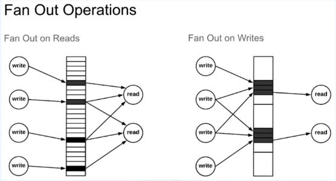
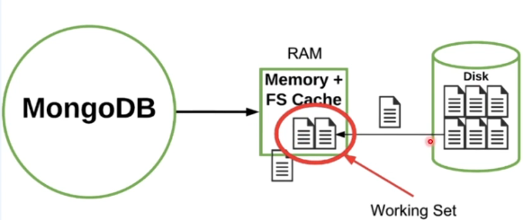

# Schema Modeling
- [Schema Modeling](#schema-modeling)
  - [01. Modeling에 대한 정의](#01-modeling에-대한-정의)

## 01. Modeling에 대한 정의
- Application의 요구사항과 Database 성능의 균형을 맞추는 것
- `Embedding` vs `Referencing`
  - `Embedding`
    
  - `Referencing`
    
    - `lookup` 이라는 `join` 기능을 활용
    - `write`의 성능은 올라가지만 `read` 성능이 느려진다.
- MongoDB의 철학은 역정규화로 `Embedding`을 통해 데이터를 저장
- 하지만, MongoDB document의 크기는 `16MB`로 제한이 되어있음
- Reducing Resources
  - CPU
     
    - 어느 시점에서 연산을 하느냐에 따라 `Fan Out on Reads`, `Fan Out on Writes`로 나뉨
  - Memory
    
    - 데이터를 캐싱할 `Working Set`의 크기를 조정
  - Storage
    - 데이터 자체의 크기를 줄이는 것 보다는 사이즈의 크기를 줄이는 것
    - 예를 들어 document 의 수를 줄임으로써 index의 수를 줄이는 것
    - 서버 스펙 측정시 일반적으로 `데이터 크기 / 3 = 인덱스 크기` 로 계산하나, 더 줄일 수 있다면 좋음
- Easy Managing
  - Collection의 수가 많아지면 인덱스 파일이 많아지고 결과적으로 Fail over 속도가 느려질 수 있음
  - Schema가 자유로운 MongoDB 지만 서로 연관성이 적다면 인덱스의 생성이나 수가 많아져 관리하는 것이 어렵게됨