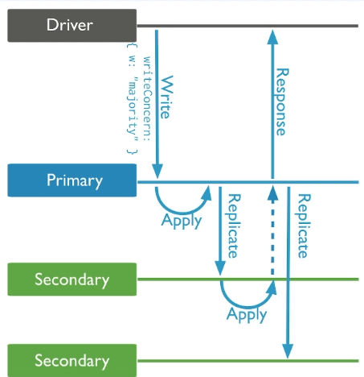
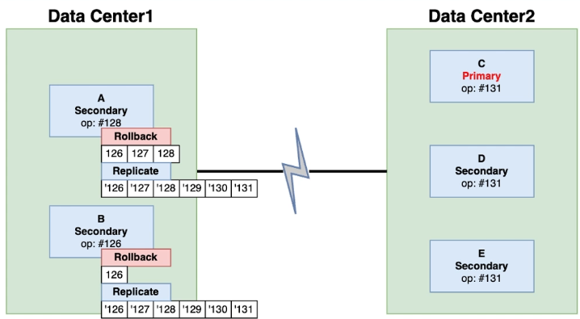
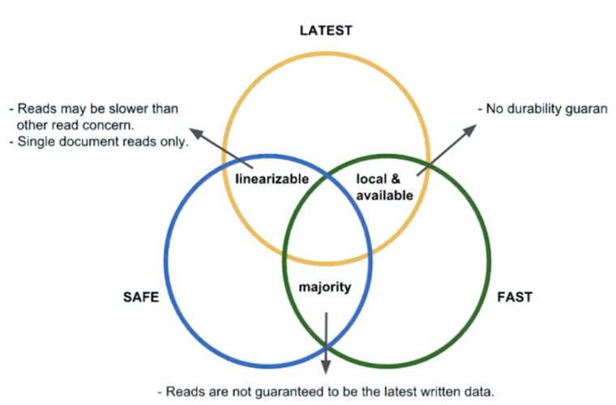

### Write Concern

- Replica Set Member들 간의 동기화 정도를 제어하는 옵션
  

  - 몇 개의 멤버까지 복제를 완료하고 사용자에게 결과를 반환할지 지정하는 옵션
  - 주 목적은 Rollback 을 방지하는 것
    
    - Data Center1 <-> Data Center2 와의 연결이 끊긴 상태에서 서버1 의 op가 #128, 서버2의 op가 #125 라면 이후 서버가 재연결되었을때 서버1은 서버2의 op#128을 찾지 못하므로 #125까지 롤백되게 됩니다.
    - 만약 `write concern` 정책을 `majority` 로 기록한 경우, 주 서버에서의 쓰기 작업이 복제된 서버들에 제대로 전파되었음을 보장하므로, 데이터 일관성이 높아지고 롤백의 가능성을 줄입니다.

- Write Concern 레벨 설정
  - `w: 1`: 기본 Write Concern 설정. 데이터가 한 서버에 기록되면 작업이 완료된 것으로 간주합니다.
  - `w: 2`: 데이터가 두 개의 서버에 기록되면 작업이 완료된 것으로 간주합니다.
  - `w: "majority"`: 데이터가 과반수의 서버에 기록될 때 작업이 완료된 것으로 간주합니다. 데이터 손실을 최소화합니다.
  - `w: 0`: Write Concern을 사용하지 않습니다. 데이터가 어떤 서버에도 기록될 필요가 없습니다. (비추천)

### Read Concern

| 옵션         | 설명                                                                               |
| ------------ | ---------------------------------------------------------------------------------- |
| local        | 복제를 확인하지 않고 요청한 Member의 현재 데이터를 반환                            |
| available    | local과 동일하지만, 고아 Document(현재 사용되고 있지 않은 데이터)를 반환할 수 있다 |
| majority     | Member 과반수가 들고 있는 동일한 데이터를 반환                                     |
| linearizable | 쿼리 수행 전에 모든 Majority Write 가 반영된 결과를 반환                           |
| snapshot     | 특정 시점에 대한 결과를 반환 (Point-In-Time Query)                                 |
