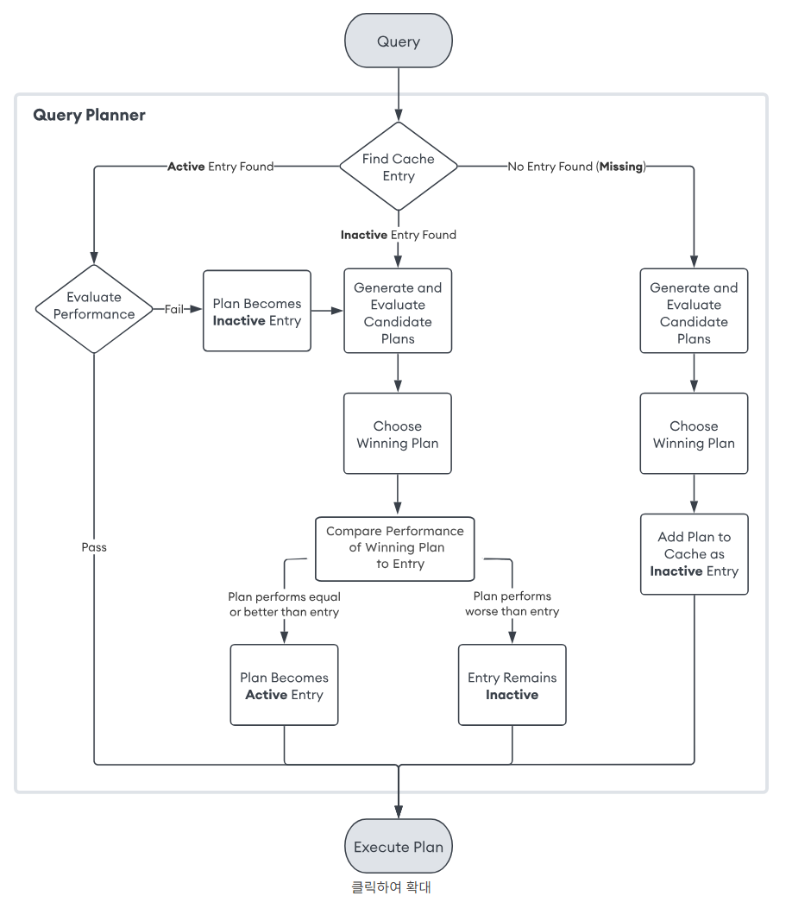

# Query 성능 분석
- [Query 성능 분석](#query-성능-분석)
  - [Query Planner Logic](#query-planner-logic)
  - [Query Plan 읽는 방법](#query-plan-읽는-방법)
    - [`cursor.explain()`](#cursorexplain)
    - [실습](#실습)
  - [Query 성능 최적화 1 (Aggregation)](#query-성능-최적화-1-aggregation)

## Query Planner Logic

- Query 수행 속도
  1. `db.test.find({a: 1})` -> 느린 응답
      - query -> disk -> cache -> return 
  2. `db.test.find({a: 1})` -> 빠른 응답
      - query -> **cache** -> return

- `Working Set`
  - 10년간 운영됨 Messaging Server 가 존재할 때
  - 1년에 1PB의 데이터가 누적된다고 하자
  - 이때 실제로 사용되는 데이터는 1 month -> 100GB 정도이고 이것을 `Working Set`이라 한다.

- Disk 와 Cache
  - Speed: Disk < Cache
  - Storage: Disk > Cache

- `Cache Eviction`
  - 100GB Working Set > 80GB Cache 일때
  - 20GB의 용량 부족을 해결하기 위해서 
  - 캐시를 올리고 내리는 작업을 하게된다.
  - 이것을 `Cache Eviction`이라고 한다.

- 문제 해결
  - Server Spec 업 스케일링: 비용이 발생되는 해결 방법
  - 모델링
  - 쿼리 튜닝
  - 비즈니스 요구사항 변경
  - `MongoDB` 내부적으로 `Optimizer`가 최적의 실행 계획을 만들어 주는 것 (`Query Plan`)
  
- Optimizer의 `Query Plan`은 최적일까?
  - Optimizer의 실행 계획은 항상 최적이 아니다.
  - 따라서, Query Plan 을 분석하고
  - 쿼리 튜닝을 진행함으로써 최적화된 쿼리를 만들어줄 필요가 있다.

## Query Plan 읽는 방법
[https://www.mongodb.com/ko-kr/docs/manual/core/query-plans/](https://www.mongodb.com/ko-kr/docs/manual/core/query-plans/)

- 쿼리 계획 및 캐시 정보
  - 특정 쿼리에 대한 쿼리 계획 정보를 보려면 `db.collection.explain()` 또는 cursor.explain()를 사용할 수 있습니다.
  - 컬렉션에 대한 계획 캐시 정보를 보려면 $planCacheStats 집계 단계를 사용할 수 있습니다.

### `cursor.explain()`
- `queryPlanner` 모드
  - 쿼리 옵티마이저를 실행하여 평가 중인 작업에 가장 적합한 계획을 선택
  - 실행 계획만 반환
  - 쿼리 최적화에 사용되는 정보 제공
  - 사용된 인덱스와 실행 경로를 이해하는 데 유용
  - `cursor.explain()`은 `queryPlanner`정보를 반환
- `executionStats` 모드
  - 쿼리 실행 계획과 실행 통계 반환
  - 수행된 쿼리의 효율성을 판단하는 데 도움
  - 문서 일치 수, 인덱스 조회, 총 실행 시간 등의 정보 포함
- `allPlansExecution` 모드
  - 실행된 모든 실행 계획과 각 계획의 실행 통계 반환
  - 여러 실행 계획을 비교하여 최적화 가능성 평가
  - 최적화되지 않은 계획의 리소스 소모를 분석하는 데 유용

### 실습
[Query Plan 읽는 방법 실습](./7.02_Query%20Plan%20읽는%20방법.mongodb.js)

## Query 성능 최적화 1 (Aggregation)
1. 실행 계획을 확인하여 작업이 많이 걸리는 곳을 파악하여 조치
2. 모델링이 변경되어서 쿼리도 변경되는 경우
3. Aggregation pipeline 에서 다음 Stage로 최대한 적은 데이터를 넘기기 위한 limit 또는 filtering 적용
  - 비지니스 요구사항 및 Stage의 순서 변경