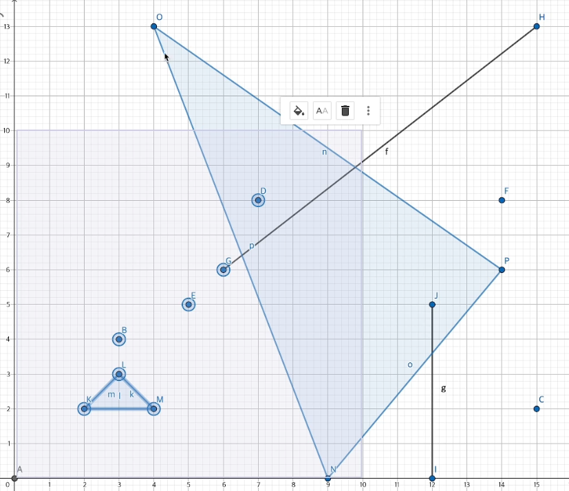

# Geospatial Queries
[https://www.mongodb.com/ko-kr/docs/manual/geospatial-queries/](https://www.mongodb.com/ko-kr/docs/manual/geospatial-queries/)

`GeoJSON` type 을 사용하여 지리 공간 데이터를 저장할 수 있다.

## GeoJson
[https://www.mongodb.com/ko-kr/docs/manual/reference/geojson/](https://www.mongodb.com/ko-kr/docs/manual/reference/geojson/)

- GeoJSON 객체 유형을 지정하는 `type` 필드
- 객체의 좌표를 지정하는 `coordinates 필드
```javascript
location: {
      type: "Point",
      coordinates: [-73.856077, 40.848447] // 경도, 위도 순서
}
```

## 지리 공간적 인덱스
### 2dsphere
- `2dsphere`은 지구와 유사한 구의 기하학을 계산
- `db.collection.createIndex()` 메소드를 사용하고 문자열 리터럴 `"2dsphere"`를 인덱스 형식으로 지정

```javascript
db.collection.createIndex( { <location field> : "2dsphere" } )
```

### 2d
- `2D` 인덱스는 2차원 평면에서 도형을 계산하는 쿼리를 지원
- 인덱스는 구체에서 계산하는 `$nearSphere` 쿼리를 지원할 수 있지만, 구체 쿼리에서는 `2dsphere` 인덱스를 사용하는 것이 좋다.
- `2d` 인덱스를 생성하려면, `db.collection.createIndex()`를 사용하여 위치 필드를 키로 지정하고 `"2d"`문자열 리터럴을 다음과 같이 인덱스 유형으로 지정

```javascript
db.collection.createIndex( { <location field> : "2d" } )
```
- `<location field>`는 레거시 좌표 쌍인 필드

---
### 예제 지역 데이터
