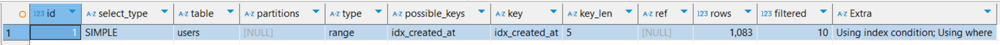
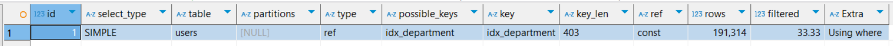
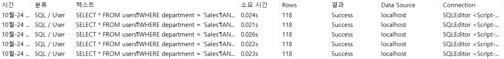

# SQL문 튜닝 연습하기
- [SQL문 튜닝 연습하기](#sql문-튜닝-연습하기)
  - [한 번에 너무 많은 데이터를 조회하는 SQL문 튜닝하기](#한-번에-너무-많은-데이터를-조회하는-sql문-튜닝하기)
  - [WHERE 문이 사용된 SQL문 튜닝하기 - 1](#where-문이-사용된-sql문-튜닝하기---1)
  - [WHERE 문이 사용된 SQL문 튜닝하기 - 2](#where-문이-사용된-sql문-튜닝하기---2)
    - [멀티 컬럼 인덱스 고려하기](#멀티-컬럼-인덱스-고려하기)
  - [인덱스를 걸었는데도 인덱스가 작동하지 않는 경우 - 1](#인덱스를-걸었는데도-인덱스가-작동하지-않는-경우---1)
  - [인덱스를 걸었는데도 인덱스가 작동하지 않는 경우 - 2](#인덱스를-걸었는데도-인덱스가-작동하지-않는-경우---2)
  - [ORDER BY 문이 사용된 SQL문 튜닝하기](#order-by-문이-사용된-sql문-튜닝하기)
    - [추가) LIMIT을 사용하지 않는 경우 테스트](#추가-limit을-사용하지-않는-경우-테스트)
  - [WHERE 문에 인덱스 걸기 vs ORDER BY 문에 인덱스를 걸기](#where-문에-인덱스-걸기-vs-order-by-문에-인덱스를-걸기)

## 한 번에 너무 많은 데이터를 조회하는 SQL문 튜닝하기
1. 테이블 생성
    ```sql  
    DROP TABLE IF EXISTS users; # 기존 테이블 삭제

    CREATE TABLE users (
        id INT AUTO_INCREMENT PRIMARY KEY,
        name VARCHAR(100),
        age INT
    );
    ```
2. 100만 건의 랜덤 데이터 삽입
```sql
-- 높은 재귀(반복) 횟수를 허용하도록 설정
-- (아래에서 생성할 더미 데이터의 개수와 맞춰서 작성하면 된다.)
SET SESSION cte_max_recursion_depth = 1000000; 

-- 더미 데이터 삽입 쿼리
INSERT INTO users (name, age)
WITH RECURSIVE cte (n) AS
(
  SELECT 1
  UNION ALL
  SELECT n + 1 FROM cte WHERE n < 1000000 -- 생성하고 싶은 더미 데이터의 개수
)
SELECT 
    CONCAT('User', LPAD(n, 7, '0')),   -- 'User' 다음에 7자리 숫자로 구성된 이름 생성
    FLOOR(1 + RAND() * 1000) AS age    -- 1부터 1000 사이의 난수로 나이 생성
FROM cte;
```
3. 데이터 조회해 보기
    - 데이터 10,000개 조회하기
      ```sql
      select * from users limit 10000;
      ```
      - 대략 `600ms` 소요
    - 데이터 10개 조회하기
      ```sql
      select * from users limit 10;
      ```
      - 대략 `200ms` 소요

> - 조회하는 데이터의 개수가 줄어들 경우 소요시간도 함께 줄어듬을 > 확인할 수 있다.
> - 실제 대부분의 서비스는 한번에 모든 데이터를 불러오는 대신 > 페이지네이션을 적용하여 일부 데이터만 조회한다.
> - 조회하는 데이터의 개수가 성능에 많은 영향을 끼치기 때문이다.
> - `LIMIT`, `WHERE` 문 등을 활용하여 조회하는 데이터의 수를 줄이는 방법을 고려해보자.

## WHERE 문이 사용된 SQL문 튜닝하기 - 1
- 최근 3일 이내에 가입한 유저 조회하기
1. 테이블 생성하기
    ```sql
    DROP TABLE IF EXISTS users; 

    CREATE TABLE users (
        id INT AUTO_INCREMENT PRIMARY KEY,
        name VARCHAR(100),
        department VARCHAR(100),
        created_at TIMESTAMP DEFAULT CURRENT_TIMESTAMP
    );
    ```
2. 100만 건의 데이터 삽압
    ```sql
    -- 높은 재귀(반복) 횟수를 허용하도록 설정
    -- (아래에서 생성할 더미 데이터의 개수와 맞춰서 작성하면 된다.)
    SET SESSION cte_max_recursion_depth = 1000000; 

    -- 더미 데이터 삽입 쿼리
    INSERT INTO users (name, department, created_at)
    WITH RECURSIVE cte (n) AS
    (
      SELECT 1
      UNION ALL
      SELECT n + 1 FROM cte WHERE n < 1000000 -- 생성하고 싶은 더미 데이터의 개수
    )
    SELECT 
        CONCAT('User', LPAD(n, 7, '0')) AS name,  -- 'User' 다음에 7자리 숫자로 구성된 이름 생성
        CASE 
            WHEN n % 10 = 1 THEN 'Engineering'
            WHEN n % 10 = 2 THEN 'Marketing'
            WHEN n % 10 = 3 THEN 'Sales'
            WHEN n % 10 = 4 THEN 'Finance'
            WHEN n % 10 = 5 THEN 'HR'
            WHEN n % 10 = 6 THEN 'Operations'
            WHEN n % 10 = 7 THEN 'IT'
            WHEN n % 10 = 8 THEN 'Customer Service'
            WHEN n % 10 = 9 THEN 'Research and Development'
            ELSE 'Product Management'
        END AS department,  -- 의미 있는 단어 조합으로 부서 이름 생성
        TIMESTAMP(DATE_SUB(NOW(), INTERVAL FLOOR(RAND() * 3650) DAY) + INTERVAL FLOOR(RAND() * 86400) SECOND) AS created_at -- 최근 10년 내의 임의의 날짜와 시간 생성
    FROM cte;

    -- 잘 생성됐는 지 확인
    SELECT COUNT(*) FROM users;
    SELECT * FROM users LIMIT 10;
    ```
3. 데이터 조회해서 성능 측정하기
    ```sql
    SELECT * FROM users
    WHERE created_at >= DATE_SUB(NOW(), INTERVAL 3 DAY);
    ```
    - 대략 `900ms`의 시간이 소요됨
4. 실행 계획 조회
    ```sql
    EXPLAIN SELECT * FROM users
    WHERE created_at >= DATE_SUB(NOW(), INTERVAL 3 DAY);
    ```
    
    - 시간은 약 `900ms`가 소요됨
    - `type=ALL`, `rows=996810`인 것을 보아, 전체 데이터를 모두 스캔하여 데이터를 찾아내는 `FULL TABLE SCAN`
    - 성능상으로 *비효율적*이다.
5. 성능 개선을 위한 인덱스 추가
    - 만약 `created_at`이 정렬되어 있다면 최근 3일 이내에 가입한 유저를 빠르게 조회할 수 있다.
    - `created_at`에 대한 인덱스를 생성해 주자
    ```sql
    CREATE INDEX idx_created_at ON users (created_at);

    SHOW INDEX FROM users;
    ```
6. 실행 계획 조회해 보기
    ```sql
    EXPLAIN SELECT * FROM users
    WHERE created_at >= DATE_SUB(NOW(), INTERVAL 3 DAY); 
    ```
    
    - 실행 시간은 `37ms`가 소요
    - `type=range`, `rows=1092` 로 **레인지 스캔(Index Range Scan)** 을 통해 빠르게 조회된 것을 확인할 수 있다.

> - `WHERE`문의 `부등호(<, >, <=, >=, =)`, `IN`, `BETWEEN`, `LIKE`와 같은 곳에서 사용되는 컬럼은 인덱스를 사용했을 때 성능이 향상될 가능성이 높다.

## WHERE 문이 사용된 SQL문 튜닝하기 - 2
- Sales 부서이면서 최근 3일 이내에 가입한 유저 조회하기
1. 테이블 생성
    ```sql
    DROP TABLE IF EXISTS users; 

    CREATE TABLE users (
        id INT AUTO_INCREMENT PRIMARY KEY,
        name VARCHAR(100),
        department VARCHAR(100),
        created_at TIMESTAMP DEFAULT CURRENT_TIMESTAMP
    );
    ```
2. 100만건의 랜덤 데이터 삽입
    ```sql
    -- 높은 재귀(반복) 횟수를 허용하도록 설정
    -- (아래에서 생성할 더미 데이터의 개수와 맞춰서 작성하면 된다.)
    SET SESSION cte_max_recursion_depth = 1000000; 

    -- 더미 데이터 삽입 쿼리
    INSERT INTO users (name, department, created_at)
    WITH RECURSIVE cte (n) AS
    (
    SELECT 1
    UNION ALL
    SELECT n + 1 FROM cte WHERE n < 1000000 -- 생성하고 싶은 더미 데이터의 개수
    )
    SELECT 
        CONCAT('User', LPAD(n, 7, '0')) AS name,  -- 'User' 다음에 7자리 숫자로 구성된 이름 생성
        CASE 
            WHEN n % 10 = 1 THEN 'Engineering'
            WHEN n % 10 = 2 THEN 'Marketing'
            WHEN n % 10 = 3 THEN 'Sales'
            WHEN n % 10 = 4 THEN 'Finance'
            WHEN n % 10 = 5 THEN 'HR'
            WHEN n % 10 = 6 THEN 'Operations'
            WHEN n % 10 = 7 THEN 'IT'
            WHEN n % 10 = 8 THEN 'Customer Service'
            WHEN n % 10 = 9 THEN 'Research and Development'
            ELSE 'Product Management'
        END AS department,  -- 의미 있는 단어 조합으로 부서 이름 생성
        TIMESTAMP(DATE_SUB(NOW(), INTERVAL FLOOR(RAND() * 3650) DAY) + INTERVAL FLOOR(RAND() * 86400) SECOND) AS created_at -- 최근 10년 내의 임의의 날짜와 시간 생성
    FROM cte;

    -- 잘 생성됐는 지 확인
    SELECT COUNT(*) FROM users;
    SELECT * FROM users LIMIT 10;
    ```
3. 데이터 조회해서 성능 측정하기
    ```sql
    SELECT * FROM users
    WHERE department = 'Sales'
    AND created_at >= DATE_SUB(NOW(), INTERVAL 3 DAY)
    ```
    - 약 `620ms`의 시간 소요
4. 실행 계획 조회해보기
    ```sql
    # 실행 계획
    EXPLAIN SELECT * FROM users
    WHERE department = 'Sales'
    AND created_at >= DATE_SUB(NOW(), INTERVAL 3 DAY);

    # 실행 계획 세부 내용
    EXPLAIN ANALYZE SELECT * FROM users
    WHERE department = 'Sales'
    AND created_at >= DATE_SUB(NOW(), INTERVAL 3 DAY);
    ```
    - 실행 계획 결과
        
        - `type`이 `ALL`인 것으로 보아 `Full Table Scan`이 발생
    - 실행 계획 세부 내용 결과
        ```
        -> Filter: ((users.department = 'Sales') and (users.created_at >= <cache>((now() - interval 3 day))))  (cost=93877 rows=33224) (actual time=0.936..831 rows=118 loops=1)
        -> Table scan on users  (cost=93877 rows=996810) (actual time=0.0664..624 rows=1e+6 loops=1)
        ```
        - `EXPLAIN ANALYZE`는 아래부터 읽어야 한다.
        - 엑세스한 100만개의 데이터 중 `department='Sales'`와 `created_at>=DATE_SUB(NOW(), INTERVAL 3 DAY)`을 만족하는 데이터를 필터링
          - 조건을 만족하는 데이터 `rows`는 118개
        - `users` 데이터 100만개를 읽는데는 `624ms`가 소요 되었으며, `filtering`작업에는 `831 - 624 = 207ms`가 소요됨
5. 성능 개선을 위한 인덱스 추가
    1. `created_at` 컬럼을 기준으로 인덱스 생성
    2. `department` 컬럼을 기준으로 인덱스 생성
    3. `department`, `created_at` 둘 다 인덱스 생성
    
    **실습**
    1. `created_at` 컬럼을 기준으로 인덱스 생성
        ```sql
        CREATE INDEX idx_created_at ON users (created_at);

        # 성능 측정
        SELECT * FROM users
        WHERE department = 'Sales'
        AND created_at >= DATE_SUB(NOW(), INTERVAL 3 DAY);

        # 실행 계획
        EXPLAIN SELECT * FROM users
        WHERE department = 'Sales'
        AND created_at >= DATE_SUB(NOW(), INTERVAL 3 DAY);

        # 실행 계획 세부 내용
        EXPLAIN ANALYZE SELECT * FROM users
        WHERE department = 'Sales'
        AND created_at >= DATE_SUB(NOW(), INTERVAL 3 DAY);
        ```
        
        - 기존 `620ms`에서 `30ms`로 큰 성능 개선이 이루어짐
        
        
        - `type=range`, `rows=1083`으로 실행 계획도 변화함
      
        ```
        -> Filter: (users.department = 'Sales')  (cost=488 rows=108) (actual time=0.107..3.92 rows=118 loops=1)
        -> Index range scan on users using idx_created_at over ('2024-10-20 23:35:25' <= created_at), with index condition: (users.created_at >= <cache>((now() - interval 3 day)))  (cost=488 rows=1083) (actual time=0.0352..3.84 rows=1083 loops=1)
        ```
        1. `idx_created_at` 인덱스를 활용해 `range scan`을 했음
            - `created_at >= DATE_SUB(NOW(), INTERVAL 3 DAY)`을 만족하는 데이터를 조회
            - 이때, 엑세스한 데이터의 개수가 `1083`개
        2. 엑세스한 `1083`개의 데이터 중 `users.department='Sales'`을 만족하는 데이터를 필터링
            - 만족하는 데이터의 수는 `118`개이다.
    2. `department` 컬럼을 기준으로 인덱스 생성
        ```sql
        # created_at 인덱스 삭제
        ALTER TABLE users DROP INDEX idx_created_at; # 기존 created_at 

        # department 속성에 대한 인덱스 생성
        CREATE INDEX idx_department ON users (department);

        # 성능 측정
        SELECT * FROM users
        WHERE department = 'Sales'
        AND created_at >= DATE_SUB(NOW(), INTERVAL 3 DAY);

        # 실행 계획
        EXPLAIN SELECT * FROM users
        WHERE department = 'Sales'
        AND created_at >= DATE_SUB(NOW(), INTERVAL 3 DAY);

        # 실행 계획 세부 내용
        EXPLAIN ANALYZE SELECT * FROM users
        WHERE department = 'Sales'
        AND created_at >= DATE_SUB(NOW(), INTERVAL 3 DAY);
        ```
        
        - 기존 `620ms` 보다 조금 향상되어 `500ms` 정도가 되었다.

        
        - `type=ref` 즉, 비고유 인덱스로 조회를 했다는 것을 알 수 있음
        - `rows=191314`로 크게 잡혀 있음. 즉, 데이터에 191,314번 엑세스 했다는 의미로 성능에 악영향을 주고 있다.

        ```
        -> Filter: (users.created_at >= <cache>((now() - interval 3 day)))  (cost=8900 rows=63765) (actual time=1.19..534 rows=118 loops=1)
        -> Index lookup on users using idx_department (department='Sales')  (cost=8900 rows=191314) (actual time=0.621..494 rows=100000 loops=1)
        ```
        1. `idx_department` 인덱스를 활용하여 `department='Sales'`를 만족하는 데이터를 조회 (1,000,000개 엑세스)
        2. 엑세스한 1,000,000개의 데이터 중 `created_at >= DATE_SUB(NOW(), INTERVAL 3 DAY)`를 만족하는 데이터 `rows=118`개를 조회
3. `created_at`, `department` 컬럼 둘 다 인덱스 생성
    ```sql
    # 위에서 이미 추가함
    # CREATE INDEX idx_department ON users (department);

    # 인덱스 추가
    CREATE INDEX idx_created_at ON users (created_at); # created_at 

    # 성능 측정
    SELECT * FROM users
    WHERE department = 'Sales'
    AND created_at >= DATE_SUB(NOW(), INTERVAL 3 DAY);

    # 실행 계획
    EXPLAIN SELECT * FROM users
    WHERE department = 'Sales'
    AND created_at >= DATE_SUB(NOW(), INTERVAL 3 DAY);

    # 실행 계획 세부 내용
    EXPLAIN ANALYZE SELECT * FROM users
    WHERE department = 'Sales'
    AND created_at >= DATE_SUB(NOW(), INTERVAL 3 DAY);
    ```
    
    - 약, `30ms`로 조회 성능이 측정됨

    
    - `possible_keys`로 `department`, `created_at`의 인덱스가 검색되었으나 실제로 사용된 index는 `created_at` index 이다.

    ```
    -> Filter: (users.department = 'Sales')  (cost=485 rows=207) (actual time=0.0437..3.84 rows=118 loops=1)
    -> Index range scan on users using idx_created_at over ('2024-10-20 23:53:21' <= created_at), with index condition: (users.created_at >= <cache>((now() - interval 3 day)))  (cost=485 rows=1078) (actual time=0.0314..3.76 rows=1078 loops=1)
    ```
    - `created_at` 컬럼의 인덱스를 사용한 결과와 같다.

> - 따라서, 실질적으로 성능 향상에 큰 효과가 있는 `created_at` 컬럼에 한해서는 인덱스를 생성하는게 효율적이다.

### 멀티 컬럼 인덱스 고려하기
1. `(created_at, department)` 멀티 컬럼 인덱스 생성
    ```sql
    # 기존의 인덱스 삭제
    ALTER TABLE users DROP INDEX idx_created_at;
    ALTER TABLE users DROP INDEX idx_department;

    # 멀티 컬럼 인덱스 생성
    CREATE INDEX idx_created_at_department ON users (created_at, department);

    SELECT * FROM users
    WHERE department = 'Sales'
    AND created_at >= DATE_SUB(NOW(), INTERVAL 3 DAY);

    # 실행 계획
    EXPLAIN SELECT * FROM users
    WHERE department = 'Sales'
    AND created_at >= DATE_SUB(NOW(), INTERVAL 3 DAY);
    ```
    
    - 약 `25ms`의 성능 개선이 이루어짐

    

2. `(department, created_at)` 멀티 컬럼 인덱스 생성
    ```sql
    # 기존의 인덱스 삭제
    ALTER TABLE users DROP INDEX idx_created_at_department;

    # 멀티 컬럼 인덱스 생성
    CREATE INDEX idx_department_created_at ON users (department, created_at);

    SELECT * FROM users
    WHERE department = 'Sales'
    AND created_at >= DATE_SUB(NOW(), INTERVAL 3 DAY);

    # 실행 계획
    EXPLAIN SELECT * FROM users
    WHERE department = 'Sales'
    AND created_at >= DATE_SUB(NOW(), INTERVAL 3 DAY);
    ```
    
    - 약 `25ms`의 성능 개선이 이루어짐

    

    - 두가지의 멀티 컬럼 인덱스를 설정해 봤지만, `created_at` 인덱스만 걸었을 때와 크게 성능 차이가 없다.
    - 이런 경우는 굳이 멀티 컬럼 인덱스를 사용하기 보다는 단일 컬럼에서 인덱스를 적용하는게 좋다.

## 인덱스를 걸었는데도 인덱스가 작동하지 않는 경우 - 1
1. 테이블 생성
    ```sql
    DROP TABLE IF EXISTS users; # 기존 테이블 삭제

    CREATE TABLE users (
        id INT AUTO_INCREMENT PRIMARY KEY,
        name VARCHAR(100),
        age INT
    );
    ```
2. 100만 건의 데이터 삽입
    ```sql
    -- 높은 재귀(반복) 횟수를 허용하도록 설정
    -- (아래에서 생성할 더미 데이터의 개수와 맞춰서 작성하면 된다.)
    SET SESSION cte_max_recursion_depth = 1000000; 

    -- 더미 데이터 삽입 쿼리
    INSERT INTO users (name, age)
    WITH RECURSIVE cte (n) AS
    (
    SELECT 1
    UNION ALL
    SELECT n + 1 FROM cte WHERE n < 1000000 -- 생성하고 싶은 더미 데이터의 개수
    )
    SELECT 
        CONCAT('User', LPAD(n, 7, '0')),   -- 'User' 다음에 7자리 숫자로 구성된 이름 생성
        FLOOR(1 + RAND() * 1000) AS age    -- 1부터 1000 사이의 난수로 나이 생성
    FROM cte;
    ```
3. 인덱스 생성하기
    ```sql
    CREATE INDEX idx_name ON users (name);
    ```
4. 실행 계획 조회해보기
    ```sql
    EXPLAIN SELECT * FROM users 
    ORDER BY name DESC;
    ```
    

> - 인덱스를 사용했음에도 **풀 테이블 스캔**으로 데이터를 조회
> - 옵티마이저가 넓은 범위의 데이터를 조회할 경우 인덱스를 활용하는 것이 더 비효율적이라고 판단
> - 즉, 인덱스 테이블을 거져 원래 테이블의 데이터를 일일히 찾는 것 보다, 바로 원래 테이블에 접근하여 모든 데이터를 정렬하는 것이 효율적이라고 판단한 것

## 인덱스를 걸었는데도 인덱스가 작동하지 않는 경우 - 2
1. 테이블 생성
    ```sql
    DROP TABLE IF EXISTS users; 

    CREATE TABLE users (
        id INT AUTO_INCREMENT PRIMARY KEY,
        name VARCHAR(100),
        salary INT,
        created_at TIMESTAMP DEFAULT CURRENT_TIMESTAMP
    );
    ```
2. 100만 건의 랜덤 데이터 삽입
    ```sql
    -- 높은 재귀(반복) 횟수를 허용하도록 설정
    -- (아래에서 생성할 더미 데이터의 개수와 맞춰서 작성하면 된다.)
    SET SESSION cte_max_recursion_depth = 1000000; 

    -- users 테이블에 더미 데이터 삽입
    INSERT INTO users (name, salary, created_at)
    WITH RECURSIVE cte (n) AS
    (
    SELECT 1
    UNION ALL
    SELECT n + 1 FROM cte WHERE n < 1000000 -- 생성하고 싶은 더미 데이터의 개수
    )
    SELECT 
        CONCAT('User', LPAD(n, 7, '0')) AS name,  -- 'User' 다음에 7자리 숫자로 구성된 이름 생성
        FLOOR(1 + RAND() * 1000000) AS salary,    -- 1부터 1000000 사이의 난수로 급여 생성
        TIMESTAMP(DATE_SUB(NOW(), INTERVAL FLOOR(RAND() * 3650) DAY) + INTERVAL FLOOR(RAND() * 86400) SECOND) AS created_at -- 최근 10년 내의 임의의 날짜와 시간 생성
    FROM cte;
    ```
3. 인덱스 생성
    ```sql
    CREATE INDEX idx_name ON users (name);
    CREATE INDEX idx_salary ON users (salary);
    ```
4. 실행 계획 조회해보기
    ```sql
    # User000000으로 시작하는 이름을 가진 유저 조회
    EXPLAIN SELECT * FROM users
    WHERE SUBSTRING(name, 1, 10) = 'User000000';
    ```
    

    ```sql
    # 2달치 급여(salary)가 1000 이하인 유저 조회
    EXPLAIN SELECT * FROM users
    WHERE salary * 2 < 1000
    ORDER BY salary;
    ```
    

> - SQL문을 작성할 인덱스 컬럼을 가공(함수 적용, 산술 연산, 문자열 조작 등)하면, MySQL은 해당 인덱스를 활용하지 못하는 경우가 많다.
> - *인덱스를 적극 활용하기 위해서는 인덱스 컬럼을 최대한 가공하지 않아야 한다.*

5. 인덱스 컬럼을 가공하지 않고 사용할 수 있도록 SQL을 수정
    ```sql
    SELECT * FROM users
    WHERE name LIKE 'User000000%'
    ```
    
    - `FULL TABLE SCAN`에서 `RANGE SCAN`으로 변경됨

    ```SQL
    SELECT * FROM users
    WHERE salary < 1000 / 2
    ORDER BY salary;
    ```
    
    - `FULL TABLE SCAN`에서 `RANGE SCAN`으로 변경됨

## ORDER BY 문이 사용된 SQL문 튜닝하기
1. 테이블 생성
    ```sql
    DROP TABLE IF EXISTS users; 

    CREATE TABLE users (
        id INT AUTO_INCREMENT PRIMARY KEY,
        name VARCHAR(100),
        department VARCHAR(100),
        salary INT,
        created_at TIMESTAMP DEFAULT CURRENT_TIMESTAMP
    );
    ```
2. 100만 건의 랜덤 데이터 삽입
    ```sql
    -- 높은 재귀(반복) 횟수를 허용하도록 설정
    -- (아래에서 생성할 더미 데이터의 개수와 맞춰서 작성하면 된다.)
    SET SESSION cte_max_recursion_depth = 1000000; 

    -- 더미 데이터 삽입 쿼리
    INSERT INTO users (name, department, salary, created_at)
    WITH RECURSIVE cte (n) AS
    (
    SELECT 1
    UNION ALL
    SELECT n + 1 FROM cte WHERE n < 1000000 -- 생성하고 싶은 더미 데이터의 개수
    )
    SELECT 
        CONCAT('User', LPAD(n, 7, '0')) AS name,  -- 'User' 다음에 7자리 숫자로 구성된 이름 생성
        CASE 
            WHEN n % 10 = 1 THEN 'Engineering'
            WHEN n % 10 = 2 THEN 'Marketing'
            WHEN n % 10 = 3 THEN 'Sales'
            WHEN n % 10 = 4 THEN 'Finance'
            WHEN n % 10 = 5 THEN 'HR'
            WHEN n % 10 = 6 THEN 'Operations'
            WHEN n % 10 = 7 THEN 'IT'
            WHEN n % 10 = 8 THEN 'Customer Service'
            WHEN n % 10 = 9 THEN 'Research and Development'
            ELSE 'Product Management'
        END AS department,  -- 의미 있는 단어 조합으로 부서 이름 생성
        FLOOR(1 + RAND() * 1000000) AS salary,    -- 1부터 1000000 사이의 난수로 나이 생성
        TIMESTAMP(DATE_SUB(NOW(), INTERVAL FLOOR(RAND() * 3650) DAY) + INTERVAL FLOOR(RAND() * 86400) SECOND) AS created_at -- 최근 10년 내의 임의의 날짜와 시간 생성
    FROM cte;
    ```
3. 데이터 조회하여 성능 측정하기
    ```sql
    SELECT * FROM users
    ORDER BY salary
    LIMIT 100;
    ```
    
    - 대략 `820ms`의 시간이 소요됨
4. 실행 계획 조회해보기
    ```sql
    # 실행 계획
    EXPLAIN SELECT * FROM users
    ORDER BY salary
    LIMIT 100;

    # 실행 계획 세부 내용
    EXPLAIN ANALYZE SELECT * FROM users
    ORDER BY salary
    LIMIT 100;
    ```
    
    - `types=ALL` 로 `FULL TABLE SCAN`이 발생
    - `ORDER BY`는 시간이 오래 걸리는 작업으로 최대한 피해주는 것이 좋다.
    - 하지만 인덱스를 사용하면 미리 정렬을 해둔 상태이기 떄문에, `ORDER BY`를 사용하여 정렬해야 하는 번거로움을 피할 수 있다.

    ```
    -> Limit: 100 row(s)  (cost=100569 rows=100) (actual time=1057..1057 rows=100 loops=1)
    -> Sort: users.salary, limit input to 100 row(s) per chunk  (cost=100569 rows=996636) (actual time=1057..1057 rows=100 loops=1)
    -> Table scan on users  (cost=100569 rows=996636) (actual time=0.0722..753 rows=1e+6 loops=1)
    ```
    1. 풀 테이블 스캔으로 100만 건의 데이터에 엑세스
    2. `users.salary`를 기준으로 정렬을 진행함
    3. `limit`으로 인해 100개의 데이터만 제한하여 조회
5. 성능 개선을 위한 인덱스 추가
    ```sql
    CREATE INDEX idx_salary ON users (salary);
    ```
6. 성능 측정
    - SQL문 실행시간
        ```sql
        SELECT * FROM users
        ORDER BY salary
        LIMIT 100;
        ```
        
        - 대략 `25ms`로 크게 성능이 개선됨
    - 실행 계획 조회해보기
        ```sql
        EXPLAIN SELECT * FROM users
        ORDER BY salary
        LIMIT 100;
        ```
        - `type=index` 로 인덱스를 적극 활용하는 것을 볼 수 있음
        - **풀 테이블 스캔** 대신 **인덱스 풀 스캔**을 활용함
        - `LIMIT` 없이 큰 범위의 데이터를 조회하는 경우 옵티마저가 인덱스를 활용하지 않고 테이블 풀 스캔을 할 수도 있음.
        - 따라서, 성능 효율을 위해 `LIMIT`을 통해 작은 데이터의 범위를 조회하는 것이 좋음
    - 실행 계획 세부 내용 조회하기
        ```sql
        EXPLAIN ANALYZE SELECT * FROM users
        ORDER BY salary
        LIMIT 100;
        ```
        ```
        -> Limit: 100 row(s)  (cost=0.0918 rows=100) (actual time=0.594..0.627 rows=100 loops=1)
        -> Index scan on users using idx_salary  (cost=0.0918 rows=100) (actual time=0.593..0.615 rows=100 loops=1)
        ```
        1. 인덱스 스캔으로 100개의 데이터에 대해서만 액세스 함
        2. (인덱스를 이용하여 정렬되어 있기 때문에 정렬 작업이 발생하지 않음)
        3. `LIMIT`에 의해 100개의 데이터만 조회

> - `ORDER BY`는 시간이 오래걸리는 작업으로 피하는 것이 좋음
> - 인덱스를 사용하면 미리 정렬을 해둔 상태이기 때문에, `ORDER BY`를 사용해서 정렬하는 번거로운 작업을 피할 수 있음
> - `LIMIT` 없이 큰 범위의 데이터를 조회하는 경우 옵티마이저가 인덱스를 활용하지 않고 풀 테이블 스캔을 해버릴 수도 있다. 따라서 성능 효율을 위해 `LIMIT`을 사용할 수 있도록 신경쓰자.

### 추가) LIMIT을 사용하지 않는 경우 테스트
1. 조회 성능 측정하기
    ```sql
    SELECT * FROM users
    ORDER BY salary;
    ```
    
    - 약 `15s`의 시간을 소요
2. 실행 계획 살펴보기
    ```sql
    EXPLAIN
    SELECT * FROM users
    ORDER BY salary;
    ```
    
    - `FULL TABLE SCAN`이 발생
3. 옵티마이저한테 강제로 `idx_salary` 인덱스를 사용하도록 하기
    ```sql
    SELECT * FROM users
    FORCE INDEX (idx_salary)
    ORDER BY salary;
    ```
    
    - 옵티마이저에게 `idx_salary` 인덱스를 강제로 사용하도록 하였다.
    - 실행 결과 `11s`가 나온다.
    - `index`를 사용했을때 성능 향상이 일어난 것이다.
    - 넓은 범위를 조회하므로 옵티마이저가 `index`를 사용하지 않았지만 성능이 개선된 경우이다.
    - 하지만, 해당 경우일뿐 매번 그런 것은 아니며 성능 역시 좋지 못하다.
    - `LIMIT`을 사용하여 적은 데이터를 조회하는 습관을 들이도록 하자

## WHERE 문에 인덱스 걸기 vs ORDER BY 문에 인덱스를 걸기
1. 테이블 생성
    ```sql
    DROP TABLE IF EXISTS users; 

    CREATE TABLE users (
        id INT AUTO_INCREMENT PRIMARY KEY,
        name VARCHAR(100),
        department VARCHAR(100),
        salary INT,
        created_at TIMESTAMP DEFAULT CURRENT_TIMESTAMP
    );
    ```
2. 100만 건의 랜덤 데이터 삽입
    ```sql
    -- 높은 재귀(반복) 횟수를 허용하도록 설정
    -- (아래에서 생성할 더미 데이터의 개수와 맞춰서 작성하면 된다.)
    SET SESSION cte_max_recursion_depth = 1000000; 

    -- 더미 데이터 삽입 쿼리
    INSERT INTO users (name, department, salary, created_at)
    WITH RECURSIVE cte (n) AS
    (
    SELECT 1
    UNION ALL
    SELECT n + 1 FROM cte WHERE n < 1000000 -- 생성하고 싶은 더미 데이터의 개수
    )
    SELECT 
        CONCAT('User', LPAD(n, 7, '0')) AS name,  -- 'User' 다음에 7자리 숫자로 구성된 이름 생성
        CASE 
            WHEN n % 10 = 1 THEN 'Engineering'
            WHEN n % 10 = 2 THEN 'Marketing'
            WHEN n % 10 = 3 THEN 'Sales'
            WHEN n % 10 = 4 THEN 'Finance'
            WHEN n % 10 = 5 THEN 'HR'
            WHEN n % 10 = 6 THEN 'Operations'
            WHEN n % 10 = 7 THEN 'IT'
            WHEN n % 10 = 8 THEN 'Customer Service'
            WHEN n % 10 = 9 THEN 'Research and Development'
            ELSE 'Product Management'
        END AS department,  -- 의미 있는 단어 조합으로 부서 이름 생성
        FLOOR(1 + RAND() * 1000000) AS salary,    -- 1부터 1000000 사이의 난수로 나이 생성
        TIMESTAMP(DATE_SUB(NOW(), INTERVAL FLOOR(RAND() * 3650) DAY) + INTERVAL FLOOR(RAND() * 86400) SECOND) AS created_at -- 최근 10년 내의 임의의 날짜와 시간 생성
    FROM cte;
    ```
3. 데이터 조회하여 성능 측정하기
    ```sql
    SELECT * FROM users
    WHERE created_at >= DATE_SUB(NOW(), INTERVAL 3 DAY)
        AND department = 'Sales'
    ORDER BY salary
    LIMIT 100;
    ```
    
    - 약 `800ms`의 시간이 소요
4. 실행 계획 확인해 보기
    ```sql
    EXPLAIN SELECT * FROM users
    WHERE created_at >= DATE_SUB(NOW(), INTERVAL 3 DAY)
        AND department = 'Sales'
    ORDER BY salary
    LIMIT 100;
    ```
    
    - `type=ALL` 로 풀테이블 스캔이 발생
5. 성능 개선을 위한 인덱스를 추가
  - `created_at`, `department`, `salary`의 컬럼에 인덱스를 걸 수 있는 선택지가 존재
  - 우선, `created_at`, `department` 컬럼 중에서 인덱스를 걸었을 때 효율적인 컬럼은 `created_at`인 것을 예상할 수 있다.
  - 위의 SQL문에서 `department='Sales'`는 데이터 엑세스가 많을 수 밖에 없기 때문이다.
  - 성능을 향상시키는 데 중요한 요소는 데이터 엑세스 수를 줄이는 것
  - 다음으로 `created_at`과 `salary` 인덱스 중 인덱스를 걸었을 때 효율적인 컬럼은 어떤 것인지 실행 계획을 보고 판단해 보자
    1. `salary`에 인덱스 걸기
        ```sql
        CREATE INDEX idx_salary ON users (salary);
        ```
        ```SQL
        -- 성능 측정
        SELECT * FROM users
        WHERE created_at >= DATE_SUB(NOW(), INTERVAL 3 DAY)
        AND department = 'Sales'
        ORDER BY salary
        LIMIT 100;
        ```
        
        - 약 `6s`가 소요됨
        - `salary`인덱스를 사용했을 때 오히려 성능히 하락
        ```SQL
        -- 실행 계획
        EXPLAIN SELECT * FROM users
        WHERE created_at >= DATE_SUB(NOW(), INTERVAL 3 DAY)
        AND department = 'Sales'
        ORDER BY salary
        LIMIT 100;
        ```
        
        - 인덱스 풀 스캔을 사용한 것을 확인 할 수 있음
        ```SQL
        -- 실행 계획 세부 내용
        EXPLAIN ANALYZE SELECT * FROM users
        WHERE created_at >= DATE_SUB(NOW(), INTERVAL 3 DAY)
        AND department = 'Sales'
        ORDER BY salary
        LIMIT 100;
        ```
        ```
        -> Limit: 100 row(s)  (cost=9.09 rows=3.33) (actual time=11.2..6405 rows=100 loops=1)
        -> Filter: ((users.department = 'Sales') and (users.created_at >= <cache>((now() - interval 3 day))))  (cost=9.09 rows=3.33) (actual time=11.2..6405 rows=100 loops=1)
        -> Index scan on users using idx_salary  (cost=9.09 rows=100) (actual time=0.522..6153 rows=966835 loops=1)
        ```
        - `idx_salary` 인덱스를 활용해 인덱스 풀 스캔을 했다. 이 인덱스를 활용했기 때문에 정렬 과정이 따로 필요 없다.
        - 그런 뒤에 `WHERE` 조건을 만족시키는 데이터 100개를 필터링한다.
        - 이떄, **인덱스에는 `created_at`, `department` 정보가 없기 때문에 실제 테이블에 접근해서 조건을 만족하는지 확인해야한다.** 즉, 풀 테이블 스캔과 다를 것이 없다.
    2. `created_at`에 인덱스를 걸기
        ```sql
        ALTER TABLE users DROP INDEX idx_salary; -- 기존 인덱스 삭제
        CREATE INDEX idx_created_at ON users (created_at);
        ```
        ```sql
        -- 성능 측정
        SELECT * FROM users
        WHERE created_at >= DATE_SUB(NOW(), INTERVAL 3 DAY)
        AND department = 'Sales'
        ORDER BY salary
        LIMIT 100;
        ```
        
        - 대략 `30ms`가 소요
        ```sql
        -- 실행 계획
        EXPLAIN SELECT * FROM users
        WHERE created_at >= DATE_SUB(NOW(), INTERVAL 3 DAY)
        AND department = 'Sales'
        ORDER BY salary
        LIMIT 100;
        ```
        
        - `INDEX RANGE SCAN`이 발생하여 성능히 향상됨
        ```sql
        -- 실행 계획 세부 내용
        EXPLAIN ANALYZE SELECT * FROM users
        WHERE created_at >= DATE_SUB(NOW(), INTERVAL 3 DAY)
        AND department = 'Sales'
        ORDER BY salary
        LIMIT 100;
        ```
        ```
        -> Limit: 100 row(s)  (cost=476 rows=100) (actual time=3.28..3.29 rows=100 loops=1)
        -> Sort: users.salary, limit input to 100 row(s) per chunk  (cost=476 rows=1058) (actual time=3.28..3.29 rows=100 loops=1)
        -> Filter: (users.department = 'Sales')  (cost=476 rows=1058) (actual time=0.0797..3.22 rows=103 loops=1)
        -> Index range scan on users using idx_created_at over ('2024-10-23 23:12:48' <= created_at), with index condition: (users.created_at >= <cache>((now() - interval 3 day)))  (cost=476 rows=1058) (actual time=0.028..3.15 rows=1058 loops=1)
        ```
        - `idx_created_at` 인덱스를 활용해 인덱스 레인지 스캔을 했다. 이때, `users.created_at >= <cache>((now() - interval 3 day))`를 만족하는 데이터에만 엑세스했다. (`rows=1120`)
        - 1번 과정에서 엑세스한 데이터 중에서 `users.department='Sales'`을 만족하는 데이터를 필터링 (`rows=104`)
        - 2번 과정으로 필터링한 104개의 데이터를 `users.salary`를 기준으로 정렬
        - `LIMIT`으로 인해 100개의 데이터만 가져온다.

> - `ORDER BY`의 특징 상 모든 데이터를 바탕으로 정렬을 진행
> - *인덱스 풀 스캔* 또는 *테이블 풀 스캔*을 활용할 수 밖에 없다.
> - 이 때문에 `ORDER BY`보다는 `WHERE`문에 있는 컬럼에 인덱스를 걸었을 때 성능이 향상되는 경우가 많다.


