# 실전 SQL문으로 튜닝 직접 해보기
- [실전 SQL문으로 튜닝 직접 해보기](#실전-sql문으로-튜닝-직접-해보기)
  - [유저 이름으로 특정 기간에 작성된 글 검색하는 SQL문 튜닝하기](#유저-이름으로-특정-기간에-작성된-글-검색하는-sql문-튜닝하기)
  - [특정 부서에서 최대 연봉을 가진 사용자들 조회하는 SQL문 튜닝하기](#특정-부서에서-최대-연봉을-가진-사용자들-조회하는-sql문-튜닝하기)
  - [부서별 최대 연봉을 가진 사용자들 조회하는 SQL문 튜닝하기](#부서별-최대-연봉을-가진-사용자들-조회하는-sql문-튜닝하기)
  - [2023년 주문 데이터 조회하는 SQL문 튜닝하기](#2023년-주문-데이터-조회하는-sql문-튜닝하기)
  - [2024년 1학기 평균 성적이 100점인 학생 조회하는 SQL문 튜닝하기](#2024년-1학기-평균-성적이-100점인-학생-조회하는-sql문-튜닝하기)
  - [좋아요 많은 순으로 게시글 조회하는 SQL문 튜닝하기](#좋아요-많은-순으로-게시글-조회하는-sql문-튜닝하기)

## 유저 이름으로 특정 기간에 작성된 글 검색하는 SQL문 튜닝하기
1. 기본 테이블 셋팅
    ```sql
    DROP TABLE IF EXISTS posts;
    DROP TABLE IF EXISTS users;

    CREATE TABLE users (
        id INT AUTO_INCREMENT PRIMARY KEY,
        name VARCHAR(50) NOT NULL,
        created_at TIMESTAMP DEFAULT CURRENT_TIMESTAMP
    );

    CREATE TABLE posts (
        id INT AUTO_INCREMENT PRIMARY KEY,
        title VARCHAR(255) NOT NULL,
        created_at TIMESTAMP DEFAULT CURRENT_TIMESTAMP,
        user_id INT,
        FOREIGN KEY (user_id) REFERENCES users(id)
    );
    ```
2. 더미 데이터 추가
    ```sql
    -- 높은 재귀(반복) 횟수를 허용하도록 설정
    -- (아래에서 생성할 더미 데이터의 개수와 맞춰서 작성하면 된다.)
    SET SESSION cte_max_recursion_depth = 1000000; 

    -- users 테이블에 더미 데이터 삽입
    INSERT INTO users (name, created_at)
    WITH RECURSIVE cte (n) AS
    (
      SELECT 1
      UNION ALL
      SELECT n + 1 FROM cte WHERE n < 1000000 -- 생성하고 싶은 더미 데이터의 개수
    )
    SELECT 
        CONCAT('User', LPAD(n, 7, '0')) AS name,  -- 'User' 다음에 7자리 숫자로 구성된 이름 생성
        TIMESTAMP(DATE_SUB(NOW(), INTERVAL FLOOR(RAND() * 3650) DAY) + INTERVAL FLOOR(RAND() * 86400) SECOND) AS created_at -- 최근 10년 내의 임의의 날짜와 시간 생성
    FROM cte;

    -- posts 테이블에 더미 데이터 삽입
    INSERT INTO posts (title, created_at, user_id)
    WITH RECURSIVE cte (n) AS
    (
      SELECT 1
      UNION ALL
      SELECT n + 1 FROM cte WHERE n < 1000000 -- 생성하고 싶은 더미 데이터의 개수
    )
    SELECT 
        CONCAT('Post', LPAD(n, 7, '0')) AS name,  -- 'User' 다음에 7자리 숫자로 구성된 이름 생성
        TIMESTAMP(DATE_SUB(NOW(), INTERVAL FLOOR(RAND() * 3650) DAY) + INTERVAL FLOOR(RAND() * 86400) SECOND) AS created_at, -- 최근 10년 내의 임의의 날짜와 시간 생성
        FLOOR(1 + RAND() * 50000) AS user_id -- 1부터 50000 사이의 난수로 급여 생성
    FROM cte;
    ```
3. 기본 SQL문 성능 측정하기
   - 2022년 1월 1일부터 2024년 3월 7일까지 `User0000046`이 작성한 게시글을 조회하는 SQL문이다.
   ```sql
   SELECT p.id, p.title, p.created_at
   FROM posts p
   JOIN users u ON p.user_id = u.id
   WHERE u.name = 'User0000046'
   AND p.created_at BETWEEN '2022-01-01' AND '2024-03-07';
   ```
   
   - 대략 `620ms`의 시간이 소요된다.

4. 실행 계획 조회하기
    ```sql
    EXPLAIN SELECT p.id, p.title, p.created_at
    FROM posts p
    JOIN users u ON p.user_id = u.id
    WHERE u.name = 'User0000046'
    AND p.created_at BETWEEN '2022-01-01' AND '2024-03-07';
    ```
    
    - 실행 계획을 조회해 보면 풀 테이블 스캔이 발생한 것을 확인할 수 있다.
    - 2번 행은 `posts.user_id` 컬럼이 `users.id` 컬럼과 `JOIN`을 했다를 의미
5. 성능 개선해보기
    - 풀 테이블 스캔을 개선하기 위해 인덱스를 추가
    - `users.name`과 `posts.created_at` 컬럼에 대한 인덱스를 추가
      ```sql
      CREATE INDEX idx_name ON users (name);
      CREATE INDEX idx_created_at ON posts (created_at);
      ```
    - 인덱스 생성 이후 실행 계획 조회
      
      - 옵티마이저는 `posts.created_at` 인덱스가 존재하는 것을 알지만 굳이 사용하지 않는게 효율적이라고 판단함
      - 따라서, 사용하지 않는 컬럼을 삭제해 주자
    - `posts.created_at` 인덱스 삭제
      ```sql
      ALTER TABLE posts DROP INDEX idx_created_at;
      ```
    - 성능 확인하기
      
      - 기존 `620ms` 대비 `20ms`로 성능이 많이 개선되었다.

## 특정 부서에서 최대 연봉을 가진 사용자들 조회하는 SQL문 튜닝하기
1. 테이블 생성
    ```sql
    DROP TABLE IF EXISTS posts;
    DROP TABLE IF EXISTS users; 

    CREATE TABLE users (
        id INT AUTO_INCREMENT PRIMARY KEY,
        name VARCHAR(100),
        department VARCHAR(100),
        salary INT,
        created_at TIMESTAMP DEFAULT CURRENT_TIMESTAMP
    );
    ```

2. 100만 건의 랜덤 데이터 생성
    ```sql
    -- 높은 재귀(반복) 횟수를 허용하도록 설정
    -- (아래에서 생성할 더미 데이터의 개수와 맞춰서 작성하면 된다.)
    SET SESSION cte_max_recursion_depth = 1000000; 

    -- 더미 데이터 삽입 쿼리
    INSERT INTO users (name, department, salary, created_at)
    WITH RECURSIVE cte (n) AS
    (
      SELECT 1
      UNION ALL
      SELECT n + 1 FROM cte WHERE n < 1000000 -- 생성하고 싶은 더미 데이터의 개수
    )
    SELECT 
        CONCAT('User', LPAD(n, 7, '0')) AS name,  -- 'User' 다음에 7자리 숫자로 구성된 이름 생성
        CASE 
            WHEN n % 10 = 1 THEN 'Engineering'
            WHEN n % 10 = 2 THEN 'Marketing'
            WHEN n % 10 = 3 THEN 'Sales'
            WHEN n % 10 = 4 THEN 'Finance'
            WHEN n % 10 = 5 THEN 'HR'
            WHEN n % 10 = 6 THEN 'Operations'
            WHEN n % 10 = 7 THEN 'IT'
            WHEN n % 10 = 8 THEN 'Customer Service'
            WHEN n % 10 = 9 THEN 'Research and Development'
            ELSE 'Product Management'
        END AS department,  -- 의미 있는 단어 조합으로 부서 이름 생성
        FLOOR(1 + RAND() * 100000) AS salary,    -- 1부터 100000 사이의 난수로 나이 생성
        TIMESTAMP(DATE_SUB(NOW(), INTERVAL FLOOR(RAND() * 3650) DAY) + INTERVAL FLOOR(RAND() * 86400) SECOND) AS created_at -- 최근 10년 내의 임의의 날짜와 시간 생성
    FROM cte;
    ```

3. 기존 SQL문 성능 체크하기
    ```sql
    SELECT *
    FROM users
    WHERE salary = (SELECT MAX(salary) FROM users)
    AND department IN ('Sales', 'Marketing', 'IT');
    ```
    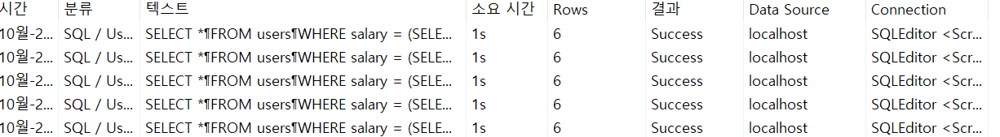
    - 약 `1s`의 실행 시간이 소요됨

4. 실행 계획 조회해보기
    ```sql
    EXPLAIN SELECT *
    FROM users
    WHERE salary = (SELECT MAX(salary) FROM users)
    AND department IN ('Sales', 'Marketing', 'IT');
    ```
    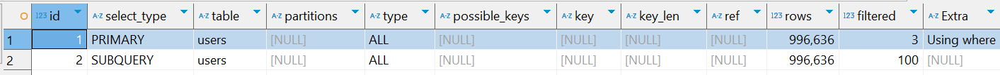
    - `FULL TABLE SCAN`이 발생

5. 인덱스 추가하기
   - 데이터 엑세스 수를 크게 줄일 수 있는 인덱스는 중복 정도가 낮은 컬럼
   - 위의 테이블에서는 `salary` 컬럼이 해당된다.
   ```sql
   create index idx_salary on users (salary);
   ```

   ```sql
   SELECT *
   FROM users
   WHERE salary = (SELECT MAX(salary) FROM users)
     AND department IN ('Sales', 'Marketing', 'IT');
   ```
   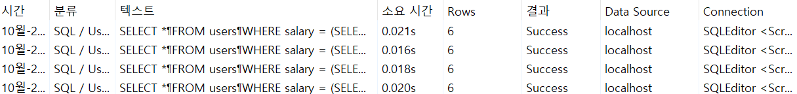
   - 기존 `1s`에서 `20ms` 정도로 성능이 크게 향상됨

   - 실행 계획 살펴보기
     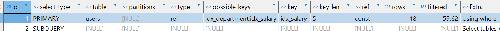
     - 인덱스를 사용해서 데이터를 엑세스 했고, 엑세스 수도 18개로 확 줄었다.


## 부서별 최대 연봉을 가진 사용자들 조회하는 SQL문 튜닝하기
1. 테이블 생성
    ```sql
    DROP TABLE IF EXISTS users; 

    CREATE TABLE users (
        id INT AUTO_INCREMENT PRIMARY KEY,
        name VARCHAR(100),
        department VARCHAR(100),
        salary INT,
        created_at TIMESTAMP DEFAULT CURRENT_TIMESTAMP
    );
    ```

2. 100만 건의 랜덤 데이터 삽입
    ```sql
    -- 높은 재귀(반복) 횟수를 허용하도록 설정
    -- (아래에서 생성할 더미 데이터의 개수와 맞춰서 작성하면 된다.)
    SET SESSION cte_max_recursion_depth = 1000000; 

    -- 더미 데이터 삽입 쿼리
    INSERT INTO users (name, department, salary, created_at)
    WITH RECURSIVE cte (n) AS
    (
      SELECT 1
      UNION ALL
      SELECT n + 1 FROM cte WHERE n < 1000000 -- 생성하고 싶은 더미 데이터의 개수
    )
    SELECT 
        CONCAT('User', LPAD(n, 7, '0')) AS name,  -- 'User' 다음에 7자리 숫자로 구성된 이름 생성
        CASE 
            WHEN n % 10 = 1 THEN 'Engineering'
            WHEN n % 10 = 2 THEN 'Marketing'
            WHEN n % 10 = 3 THEN 'Sales'
            WHEN n % 10 = 4 THEN 'Finance'
            WHEN n % 10 = 5 THEN 'HR'
            WHEN n % 10 = 6 THEN 'Operations'
            WHEN n % 10 = 7 THEN 'IT'
            WHEN n % 10 = 8 THEN 'Customer Service'
            WHEN n % 10 = 9 THEN 'Research and Development'
            ELSE 'Product Management'
        END AS department,  -- 의미 있는 단어 조합으로 부서 이름 생성
        FLOOR(1 + RAND() * 100000) AS salary,    -- 1부터 100000 사이의 난수로 나이 생성
        TIMESTAMP(DATE_SUB(NOW(), INTERVAL FLOOR(RAND() * 3650) DAY) + INTERVAL FLOOR(RAND() * 86400) SECOND) AS created_at -- 최근 10년 내의 임의의 날짜와 시간 생성
    FROM cte;
    ```

3. 기존 SQL문 성능 체크하기
    ```sql
    SELECT u.id, u.name, u.department, u.salary, u.created_at
    FROM users u
    JOIN (
        SELECT department, MAX(salary) AS max_salary
        FROM users
        GROUP BY department
    ) d ON u.department = d.department AND u.salary = d.max_salary;
    ```
    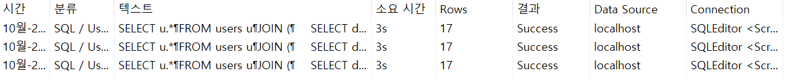
    - 약 `3s`의 시간이 소요 

4. 실행 계획 조회하기
    ```sql
    EXPLAIN SELECT u.*
    FROM users u
    JOIN (
        SELECT department, MAX(salary) AS max_salary
        FROM users
        GROUP BY department
    ) d ON u.department = d.department AND u.salary = d.max_salary;
    ```
    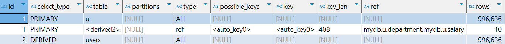
    - JOIN 문 내부에 있는 서브쿼리를 실행시킬 때 풀 테이블 스캔이 이뤄졌음을 알 수 있다.

5. 성능 개선해보기
   - `GROUP BY department`는 `department`를 기준으로 정렬을 시킨 뒤에 `MAX(salary)` 값을 구하게 됨
   - 이떄, `MAX(salary)`를 구하기 위해 찾아다닐 수 밖에 없다.
   - 이를 해결하기 위해 `(department, salary)`의 멀티 컬럼 인덱스가 있으면 `department`를 기준으로 정렬하는 작업을 하지 않아도 됨
   - 심지어 `MAX(salary)` 값도 빠르게 찾을 수 있음
   ```sql
   CREATE INDEX idx_department_salary ON users (department, salary);
   ```

6. 성능 테스트
    ```sql
    SELECT u.*
    FROM users u
    JOIN (
        SELECT department, MAX(salary) AS max_salary
        FROM users
        GROUP BY department
    ) d ON u.department = d.department AND u.salary = d.max_salary;
    ```
    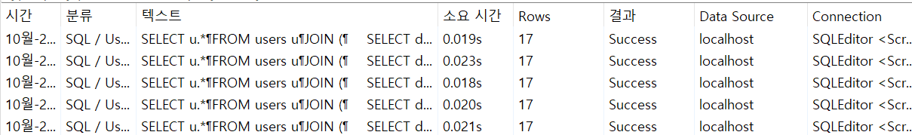
    - 기존 `3s` 대비 `20ms`로 엄청난 성능 향상이 이루어짐

    **실행 계획 조회**  
    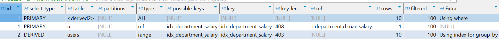
    - 인덱스를 잘 활용하여 데이터를 찾고 있으며 접근한 `rows`도 확연히 적어진 것을 확인할 수 있다.

## 2023년 주문 데이터 조회하는 SQL문 튜닝하기
1. 기본 테이블 생성
    ```sql
    DROP TABLE IF EXISTS users; 
    DROP TABLE IF EXISTS orders; 

    CREATE TABLE users (
        id INT AUTO_INCREMENT PRIMARY KEY,
        name VARCHAR(100),
        created_at TIMESTAMP DEFAULT CURRENT_TIMESTAMP
    );

    CREATE TABLE orders (
        id INT AUTO_INCREMENT PRIMARY KEY,
        ordered_at TIMESTAMP DEFAULT CURRENT_TIMESTAMP,
        user_id INT,
        FOREIGN KEY (user_id) REFERENCES users(id)
    );
    ```
2. 더미 데이터 추가
    ```sql
    -- 높은 재귀(반복) 횟수를 허용하도록 설정
    -- (아래에서 생성할 더미 데이터의 개수와 맞춰서 작성하면 된다.)
    SET SESSION cte_max_recursion_depth = 1000000; 

    -- users 테이블에 더미 데이터 삽입
    INSERT INTO users (name, created_at)
    WITH RECURSIVE cte (n) AS
    (
      SELECT 1
      UNION ALL
      SELECT n + 1 FROM cte WHERE n < 1000000 -- 생성하고 싶은 더미 데이터의 개수
    )
    SELECT 
        CONCAT('User', LPAD(n, 7, '0')) AS name,  -- 'User' 다음에 7자리 숫자로 구성된 이름 생성
        TIMESTAMP(DATE_SUB(NOW(), INTERVAL FLOOR(RAND() * 3650) DAY) + INTERVAL FLOOR(RAND() * 86400) SECOND) AS created_at -- 최근 10년 내의 임의의 날짜와 시간 생성
    FROM cte;

    -- orders 테이블에 더미 데이터 삽입
    INSERT INTO orders (ordered_at, user_id)
    WITH RECURSIVE cte (n) AS
    (
      SELECT 1
      UNION ALL
      SELECT n + 1 FROM cte WHERE n < 1000000 -- 생성하고 싶은 더미 데이터의 개수
    )
    SELECT 
        TIMESTAMP(DATE_SUB(NOW(), INTERVAL FLOOR(RAND() * 3650) DAY) + INTERVAL FLOOR(RAND() * 86400) SECOND) AS ordered_at, -- 최근 10년 내의 임의의 날짜와 시간 생성
        FLOOR(1 + RAND() * 1000000) AS user_id    -- 1부터 1000000 사이의 난수로 급여 생성
    FROM cte;
    ```
3. 기존 SQL문 성능 조회해보기
    ```sql
    SELECT *
    FROM orders
    WHERE YEAR(ordered_at) = 2023
    ORDER BY ordered_at
    LIMIT 30;
    ```
    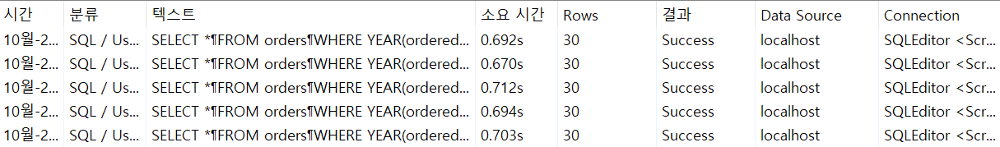
    - 약 `700ms`의 시간이 소요

4. 실행 계획 조회해보기
    ```sql
    EXPLAIN SELECT *
    FROM orders
    WHERE YEAR(ordered_at) = 2023
    ORDER BY ordered_at
    LIMIT 30;
    ```
    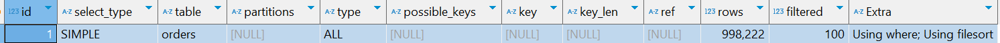
    - 풀 테이블 스캔이 발생

5. 성능 개선해보기
   - `ordered_at`에 인덱스를 추가하면 풀 테이블 스캔을 막을 수 있을 것으로 예상
   - `ordered_at`에 인덱스를 추가
     ```sql
     CREATE INDEX idx_ordered_at ON orders (ordered_at);
     ```
   - 성능 측정해 보기
     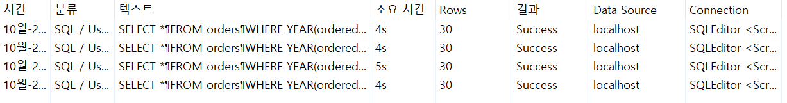
     - 인덱스를 걸었음에도 불구하고 오히려 시간이 증가했다.
   - 실행 계획을 살펴보자
     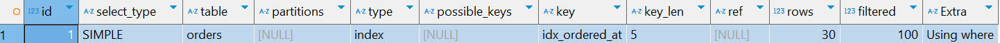
     - *풀 테이블 스캔* 대신에 *인덱스 풀 스캔*을 하면 더 빨라져야 하는데 오히려 느려짐
     - 그리고, WHERE문으로 특정 범위의 데이터만 접근하면 *인덱스 풀 스캔*이 아니라 *인덱스 레인지 스캔*이 나와야함
   - 문제 해결
     - 인덱스 컬럼을 가공(`YEAR(ordered_at) = 2023`)해서 사용했기 때문에 성능이 하락한 것
      ```sql
      SELECT *
      FROM orders
      WHERE ordered_at >= '2023-01-01 00:00:00' 
        AND ordered_at < '2024-01-01 00:00:00'
      ORDER BY ordered_at
      LIMIT 30;
      ```
      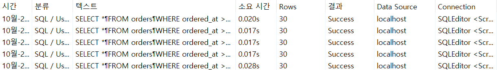
      - `20ms`로 성능 향상이 이루어 졌다.

      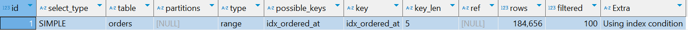
      - *인덱스 풀 스캔*에서 *인덱스 레인지 스캔*으로 변경됨


## 2024년 1학기 평균 성적이 100점인 학생 조회하는 SQL문 튜닝하기
1. 기본 테이블 생성
    ```sql
    DROP TABLE IF EXISTS scores;
    DROP TABLE IF EXISTS subjects;
    DROP TABLE IF EXISTS students;

    CREATE TABLE students (
        student_id INT AUTO_INCREMENT PRIMARY KEY,
        name VARCHAR(100),
        age INT
    );

    CREATE TABLE subjects (
        subject_id INT AUTO_INCREMENT PRIMARY KEY,
        name VARCHAR(100)
    );

    CREATE TABLE scores (
        score_id INT AUTO_INCREMENT PRIMARY KEY,
        student_id INT,
        subject_id INT,
        year INT,
        semester INT,
        score INT,
        FOREIGN KEY (student_id) REFERENCES students(student_id),
        FOREIGN KEY (subject_id) REFERENCES subjects(subject_id)
    );
    ```

2. 더미 데이터 추가
    ```sql
    -- 높은 재귀(반복) 횟수를 허용하도록 설정
    -- (아래에서 생성할 더미 데이터의 개수와 맞춰서 작성하면 된다.)
    SET SESSION cte_max_recursion_depth = 1000000; 

    -- students 테이블에 더미 데이터 삽입
    INSERT INTO students (name, age)
    WITH RECURSIVE cte (n) AS
    (
    SELECT 1
    UNION ALL
    SELECT n + 1 FROM cte WHERE n < 1000000 -- 생성하고 싶은 더미 데이터의 개수
    )
    SELECT 
        CONCAT('Student', LPAD(n, 7, '0')) AS name,  -- 'User' 다음에 7자리 숫자로 구성된 이름 생성
        FLOOR(1 + RAND() * 100) AS age -- 1부터 100 사이의 랜덤한 점수 생성
    FROM cte;

    -- subjects 테이블에 과목 데이터 삽입
    INSERT INTO subjects (name)
    VALUES
        ('Mathematics'),
        ('English'),
        ('History'),
        ('Biology'),
        ('Chemistry'),
        ('Physics'),
        ('Computer Science'),
        ('Art'),
        ('Music'),
        ('Physical Education'),
        ('Geography'),
        ('Economics'),
        ('Psychology'),
        ('Philosophy'),
        ('Languages'),
        ('Engineering');

    -- scores 테이블에 더미 데이터 삽입
    INSERT INTO scores (student_id, subject_id, year, semester, score)
    WITH RECURSIVE cte (n) AS
    (
    SELECT 1
    UNION ALL
    SELECT n + 1 FROM cte WHERE n < 1000000 -- 생성하고 싶은 더미 데이터의 개수
    )
    SELECT 
        FLOOR(1 + RAND() * 1000000) AS student_id,  -- 1부터 1000000 사이의 난수로 학생 ID 생성
        FLOOR(1 + RAND() * 16) AS subject_id,             -- 1부터 16 사이의 난수로 과목 ID 생성
        YEAR(NOW()) - FLOOR(RAND() * 5) AS year,   -- 최근 5년 내의 임의의 연도 생성
        FLOOR(1 + RAND() * 2) AS semester,                -- 1 또는 2 중에서 랜덤하게 학기 생성
        FLOOR(1 + RAND() * 100) AS score -- 1부터 100 사이의 랜덤한 점수 생성
    FROM cte;
    ```

3. 기존 SQL문 성능 조회하기
    ```sql
    SELECT 
        st.student_id,
        st.name,
        AVG(sc.score) AS average_score
    FROM 
        students st
    JOIN 
        scores sc ON st.student_id = sc.student_id
    GROUP BY 
        st.student_id,
        st.name,
        sc.year,
        sc.semester
    HAVING 
        AVG(sc.score) = 100
        AND sc.year = 2024
        AND sc.semester = 1;
    ```
    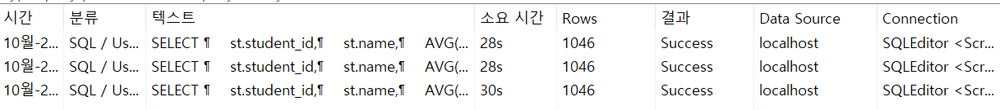
    - 약 `29s`가 소요됨
    - 굉장히 오랜 시간이 소요됨
    - `HAVING` 절에 굳이 있지 않아도 될 조건이 HAVING 절에 포함됨 (`sc.year`, `sc.semester`)

4. 성능 개선해보기
    - `HAVING` 절에 있지 않아도 되는 컬럼을 `WHERE` 조건으로 옮기고 성능 테스트
    ```sql
    SELECT 
        st.student_id,
        st.name,
        AVG(sc.score) AS average_score
    FROM 
        students st
    JOIN 
        scores sc ON st.student_id = sc.student_id
    WHERE 
        sc.year = 2024
        AND sc.semester = 1
    GROUP BY 
        st.student_id,
        st.name
    HAVING 
        AVG(sc.score) = 100;
    ```
    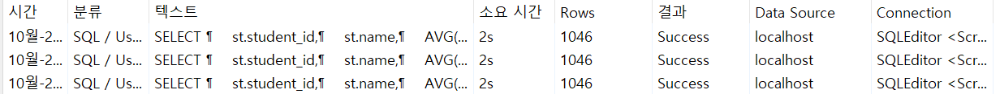
    - HAVING 절에 불필요한 조건을 삭제하니 성능이 많이 개선됨 

## 좋아요 많은 순으로 게시글 조회하는 SQL문 튜닝하기
1. 기본 테이블 셋팅
    ```sql
    DROP TABLE IF EXISTS likes;
    DROP TABLE IF EXISTS orders;
    DROP TABLE IF EXISTS users;
    DROP TABLE IF EXISTS posts;


    CREATE TABLE posts (
        id INT AUTO_INCREMENT PRIMARY KEY,
        title VARCHAR(255) NOT NULL,
        created_at TIMESTAMP DEFAULT CURRENT_TIMESTAMP
    );

    CREATE TABLE users (
        id INT AUTO_INCREMENT PRIMARY KEY,
        name VARCHAR(50) NOT NULL,
        created_at TIMESTAMP DEFAULT CURRENT_TIMESTAMP
    );

    CREATE TABLE likes (
        id INT AUTO_INCREMENT PRIMARY KEY,
        post_id INT,
        user_id INT,
        created_at TIMESTAMP DEFAULT CURRENT_TIMESTAMP,
        FOREIGN KEY (post_id) REFERENCES posts(id),
        FOREIGN KEY (user_id) REFERENCES users(id)
    );
    ```
2. 더미 데이터 추가
    ```sql
    -- 높은 재귀(반복) 횟수를 허용하도록 설정
    -- (아래에서 생성할 더미 데이터의 개수와 맞춰서 작성하면 된다.)
    SET SESSION cte_max_recursion_depth = 1000000; 

    -- posts 테이블에 더미 데이터 삽입
    INSERT INTO posts (title, created_at)
    WITH RECURSIVE cte (n) AS
    (
    SELECT 1
    UNION ALL
    SELECT n + 1 FROM cte WHERE n < 1000000 -- 생성하고 싶은 더미 데이터의 개수
    )
    SELECT 
        CONCAT('Post', LPAD(n, 7, '0')) AS name,  -- 'User' 다음에 7자리 숫자로 구성된 이름 생성
        TIMESTAMP(DATE_SUB(NOW(), INTERVAL FLOOR(RAND() * 3650) DAY) + INTERVAL FLOOR(RAND() * 86400) SECOND) AS created_at -- 최근 10년 내의 임의의 날짜와 시간 생성
    FROM cte;

    -- users 테이블에 더미 데이터 삽입
    INSERT INTO users (name, created_at)
    WITH RECURSIVE cte (n) AS
    (
    SELECT 1
    UNION ALL
    SELECT n + 1 FROM cte WHERE n < 1000000 -- 생성하고 싶은 더미 데이터의 개수
    )
    SELECT 
        CONCAT('User', LPAD(n, 7, '0')) AS name,  -- 'User' 다음에 7자리 숫자로 구성된 이름 생성
        TIMESTAMP(DATE_SUB(NOW(), INTERVAL FLOOR(RAND() * 3650) DAY) + INTERVAL FLOOR(RAND() * 86400) SECOND) AS created_at -- 최근 10년 내의 임의의 날짜와 시간 생성
    FROM cte;

    -- likes 테이블에 더미 데이터 삽입
    INSERT INTO likes (post_id, user_id, created_at)
    WITH RECURSIVE cte (n) AS
    (
    SELECT 1
    UNION ALL
    SELECT n + 1 FROM cte WHERE n < 1000000 -- 생성하고 싶은 더미 데이터의 개수
    )
    SELECT 
        FLOOR(1 + RAND() * 1000000) AS post_id,    -- 1부터 1000000 사이의 난수로 급여 생성
        FLOOR(1 + RAND() * 1000000) AS user_id,    -- 1부터 1000000 사이의 난수로 급여 생성
        TIMESTAMP(DATE_SUB(NOW(), INTERVAL FLOOR(RAND() * 3650) DAY) + INTERVAL FLOOR(RAND() * 86400) SECOND) AS created_at -- 최근 10년 내의 임의의 날짜와 시간 생성
    FROM cte;
    ```
3. 성능 개선해야할 SQL 문
    ```sql
    SELECT
        p.id,
        p.title,
        p.created_at,
        COUNT(l.id) AS like_count
    FROM
        posts p
    INNER JOIN
        likes l ON p.id = l.post_id
    GROUP BY
        p.id, p.title, p.created_at
    ORDER BY
        like_count DESC
    LIMIT 30;
    ```
    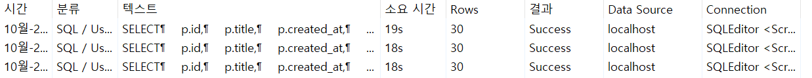
    - 대략 `18s`의 시간이 소요되고 있다.

4. 실행 계획 조회해보기
    ```sql
    EXPLAIN SELECT
        p.id,
        p.title,
        p.created_at,
        COUNT(l.id) AS like_count
    FROM
        posts p
    INNER JOIN
        likes l ON p.id = l.post_id
    GROUP BY
        p.id, p.title, p.created_at
    ORDER BY
        like_count DESC
    LIMIT 30;
    ```
    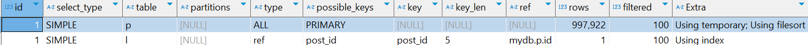
    - `type=ALL`로 풀 테이블 스캔이 이루어짐

    ```sql
    EXPLAIN ANALYZE SELECT
        p.id,
        p.title,
        p.created_at,
        COUNT(l.id) AS like_count
    FROM
        posts p
    INNER JOIN
        likes l ON p.id = l.post_id
    GROUP BY
        p.id, p.title, p.created_at
    ORDER BY
        like_count DESC
    LIMIT 30;
    ```
    ```
    -> Limit: 30 row(s)  (actual time=19186..19186 rows=30 loops=1)
    -> Sort: like_count DESC, limit input to 30 row(s) per chunk  (actual time=19186..19186 rows=30 loops=1)
    -> Table scan on <temporary>  (actual time=18706..19031 rows=589779 loops=1)
    -> Aggregate using temporary table  (actual time=18706..18706 rows=589778 loops=1)
    -> Nested loop inner join  (cost=449682 rows=997922) (actual time=0.104..6409 rows=1e+6 loops=1)
    -> Table scan on p  (cost=100409 rows=997922) (actual time=0.0781..712 rows=1e+6 loops=1)
    -> Covering index lookup on l using post_id (post_id=p.id)  (cost=0.25 rows=1) (actual time=0.00425..0.00525 rows=1 loops=1e+6)
    ```
    - 세부 실행 계획을 보니 `INNER JOIN`과 `GROUP BY`에 시간이 많이 소요됨
    - `INNER JOIN`, `GROUP BY`시 풀 테이블 스캔으로 조회한 데이터 100만 개를 처리하느라 성능 하락

5. 성능 개선
    ```sql
    SELECT p.*, l.like_count
    FROM posts p
    INNER JOIN
        (SELECT post_id, count(post_id) AS like_count FROM likes l
        GROUP BY l.post_id
        ORDER BY like_count DESC
        LIMIT 30) l
    ON p.id = l.post_id;
    ```
    - 이전의 SQL문은 `INNER JOIN`을 한 뒤에 `GROUP BY`를 했었다.
    - 하지만 위의 SQL문은 `likes` 테이블만 가지고 먼저 `GROUP BY`를 한 뒤 좋아요 수가 많은 `post_id`를 찾아낸다.
    - 이떄, `GROUP BY` 과정에서 `post_id`만 사용하기 때문에 인덱스를 활용하므로 속도가 빠르다. (커버링 인덱스)
    - 그러고 기존 `posts` 테이블과 걸러진 30개 행을 가진 테이블과 `INNER JOIN`을 함으로써 데이터 엑세스 수를 줄일 수 있었다.
    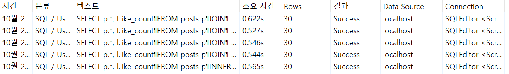
    - 약 `580ms`로 성능이 많이 개선되었다.

6. 성능 개선 후 실행 계획
    ```sql
    EXPLAIN SELECT p.*, l.like_count
    FROM posts p
    INNER JOIN
        (SELECT post_id, count(post_id) AS like_count FROM likes l
        GROUP BY l.post_id
        ORDER BY like_count DESC
        LIMIT 30) l
    ON p.id = l.post_id;
    ```
    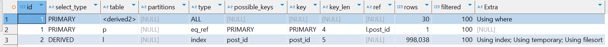
    - *풀 테이블 스캔*으로 엑세스한 데이터의 수가 30개로 줄었다.
    - `l` 테이블에서는 `인덱스 풀 스캔`이 이루어짐
    - 즉, 대부분의 데이터를 `풀 테이블 스캔`을 하던 걸 `풀 인덱스 스캔`으로 수정한 것

    ```sql
    EXPLAIN ANALYZE SELECT p.*, l.like_count
    FROM posts p
    INNER JOIN
        (SELECT post_id, count(post_id) AS like_count FROM likes l
        GROUP BY l.post_id
        ORDER BY like_count DESC
        LIMIT 30) l
    ON p.id = l.post_id;
    ```
    ```
    -> Nested loop inner join  (cost=16.4 rows=30) (actual time=760..761 rows=30 loops=1)
    -> Filter: (l.post_id is not null)  (cost=0.196..5.88 rows=30) (actual time=760..760 rows=30 loops=1)
    -> Table scan on l  (cost=2.5..2.5 rows=0) (actual time=760..760 rows=30 loops=1)
    -> Materialize  (cost=0..0 rows=0) (actual time=760..760 rows=30 loops=1)
    -> Limit: 30 row(s)  (actual time=760..760 rows=30 loops=1)
    -> Sort: like_count DESC, limit input to 30 row(s) per chunk  (actual time=760..760 rows=30 loops=1)
    -> Stream results  (cost=201947 rows=998038) (actual time=0.109..658 rows=589779 loops=1)
    -> Group aggregate: count(l.post_id)  (cost=201947 rows=998038) (actual time=0.103..510 rows=589779 loops=1)
    -> Covering index scan on l using post_id  (cost=102143 rows=998038) (actual time=0.0916..330 rows=1e+6 loops=1)
    -> Single-row index lookup on p using PRIMARY (id=l.post_id)  (cost=0.253 rows=1) (actual time=0.0115..0.0116 rows=1 loops=30)
    ```
    - 실제 커버링 인덱스를 활용한 것을 알 수 있음
    - 풀 테이블 스캔의 데이터보다 훨씬 크기가 작은 커버링 인덱스만을 활용해서 `GROUP BY`를 실행하여 성능이 향상됨