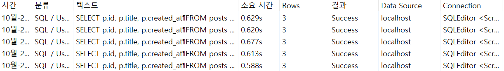
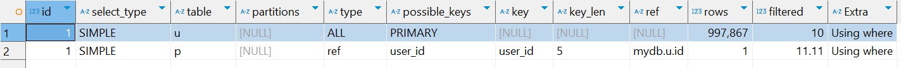
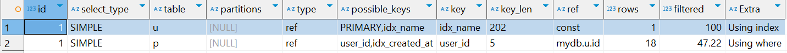
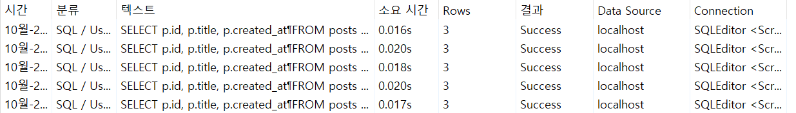

# 실전 SQL문으로 튜닝 직접 해보기
- [실전 SQL문으로 튜닝 직접 해보기](#실전-sql문으로-튜닝-직접-해보기)
  - [유저 이름으로 특정 기간에 작성된 글 검색하는 SQL문 튜닝하기](#유저-이름으로-특정-기간에-작성된-글-검색하는-sql문-튜닝하기)
  - [특정 부서에서 최대 연봉을 가진 사용자들 조회하는 SQL문 튜닝하기](#특정-부서에서-최대-연봉을-가진-사용자들-조회하는-sql문-튜닝하기)
  - [부서별 최대 연봉을 가진 사용자들 조회하는 SQL문 튜닝하기](#부서별-최대-연봉을-가진-사용자들-조회하는-sql문-튜닝하기)
  - [2023년 주문 데이터 조회하는 SQL문 튜닝하기](#2023년-주문-데이터-조회하는-sql문-튜닝하기)
  - [2024년 1학기 평균 성적이 100점인 학생 조회하는 SQL문 튜닝하기](#2024년-1학기-평균-성적이-100점인-학생-조회하는-sql문-튜닝하기)
  - [좋아요 많은 순으로 게시글 조회하는 SQL문 튜닝하기](#좋아요-많은-순으로-게시글-조회하는-sql문-튜닝하기)

## 유저 이름으로 특정 기간에 작성된 글 검색하는 SQL문 튜닝하기
1. 기본 테이블 셋팅
    ```sql
    DROP TABLE IF EXISTS posts;
    DROP TABLE IF EXISTS users;

    CREATE TABLE users (
        id INT AUTO_INCREMENT PRIMARY KEY,
        name VARCHAR(50) NOT NULL,
        created_at TIMESTAMP DEFAULT CURRENT_TIMESTAMP
    );

    CREATE TABLE posts (
        id INT AUTO_INCREMENT PRIMARY KEY,
        title VARCHAR(255) NOT NULL,
        created_at TIMESTAMP DEFAULT CURRENT_TIMESTAMP,
        user_id INT,
        FOREIGN KEY (user_id) REFERENCES users(id)
    );
    ```
2. 더미 데이터 추가
    ```sql
    -- 높은 재귀(반복) 횟수를 허용하도록 설정
    -- (아래에서 생성할 더미 데이터의 개수와 맞춰서 작성하면 된다.)
    SET SESSION cte_max_recursion_depth = 1000000; 

    -- users 테이블에 더미 데이터 삽입
    INSERT INTO users (name, created_at)
    WITH RECURSIVE cte (n) AS
    (
      SELECT 1
      UNION ALL
      SELECT n + 1 FROM cte WHERE n < 1000000 -- 생성하고 싶은 더미 데이터의 개수
    )
    SELECT 
        CONCAT('User', LPAD(n, 7, '0')) AS name,  -- 'User' 다음에 7자리 숫자로 구성된 이름 생성
        TIMESTAMP(DATE_SUB(NOW(), INTERVAL FLOOR(RAND() * 3650) DAY) + INTERVAL FLOOR(RAND() * 86400) SECOND) AS created_at -- 최근 10년 내의 임의의 날짜와 시간 생성
    FROM cte;

    -- posts 테이블에 더미 데이터 삽입
    INSERT INTO posts (title, created_at, user_id)
    WITH RECURSIVE cte (n) AS
    (
      SELECT 1
      UNION ALL
      SELECT n + 1 FROM cte WHERE n < 1000000 -- 생성하고 싶은 더미 데이터의 개수
    )
    SELECT 
        CONCAT('Post', LPAD(n, 7, '0')) AS name,  -- 'User' 다음에 7자리 숫자로 구성된 이름 생성
        TIMESTAMP(DATE_SUB(NOW(), INTERVAL FLOOR(RAND() * 3650) DAY) + INTERVAL FLOOR(RAND() * 86400) SECOND) AS created_at, -- 최근 10년 내의 임의의 날짜와 시간 생성
        FLOOR(1 + RAND() * 50000) AS user_id -- 1부터 50000 사이의 난수로 급여 생성
    FROM cte;
    ```
3. 기본 SQL문 성능 측정하기
   - 2022년 1월 1일부터 2024년 3월 7일까지 `User0000046`이 작성한 게시글을 조회하는 SQL문이다.
   ```sql
   SELECT p.id, p.title, p.created_at
   FROM posts p
   JOIN users u ON p.user_id = u.id
   WHERE u.name = 'User0000046'
   AND p.created_at BETWEEN '2022-01-01' AND '2024-03-07';
   ```
   
   - 대략 `620ms`의 시간이 소요된다.

4. 실행 계획 조회하기
    ```sql
    EXPLAIN SELECT p.id, p.title, p.created_at
    FROM posts p
    JOIN users u ON p.user_id = u.id
    WHERE u.name = 'User0000046'
    AND p.created_at BETWEEN '2022-01-01' AND '2024-03-07';
    ```
    
    - 실행 계획을 조회해 보면 풀 테이블 스캔이 발생한 것을 확인할 수 있다.
5. 성능 개선해보기
    - 풀 테이블 스캔을 개선하기 위해 인덱스를 추가
    - `users.name`과 `posts.created_at` 컬럼에 대한 인덱스를 추가
      ```sql
      CREATE INDEX idx_name ON users (name);
      CREATE INDEX idx_created_at ON posts (created_at);
      ```
    - 인덱스 생성 이후 실행 계획 조회
      
      - 옵티마이저는 `posts.created_at` 인덱스가 존재하는 것을 알지만 굳이 사용하지 않는게 효율적이라고 판단함
      - 따라서, 사용하지 않는 컬럼을 삭제해 주자
    - `posts.created_at` 인덱스 삭제
      ```sql
      ALTER TABLE posts DROP INDEX idx_created_at;
      ```
    - 성능 확인하기
      
      - 기존 `620ms` 대비 `20ms`로 성능이 많이 개선되었다.

## 특정 부서에서 최대 연봉을 가진 사용자들 조회하는 SQL문 튜닝하기

## 부서별 최대 연봉을 가진 사용자들 조회하는 SQL문 튜닝하기

## 2023년 주문 데이터 조회하는 SQL문 튜닝하기

## 2024년 1학기 평균 성적이 100점인 학생 조회하는 SQL문 튜닝하기

## 좋아요 많은 순으로 게시글 조회하는 SQL문 튜닝하기
