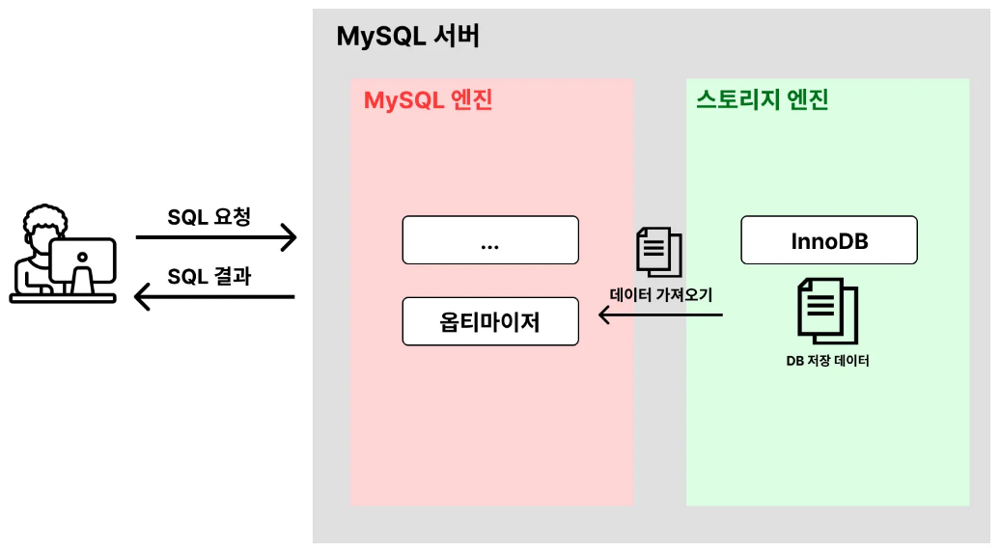
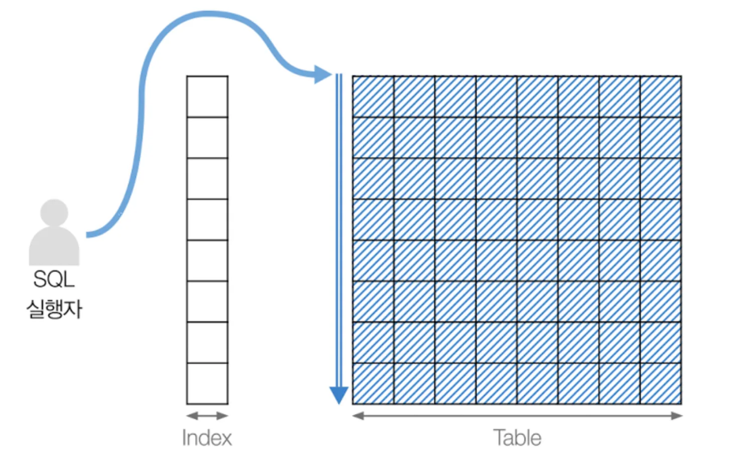
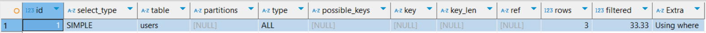
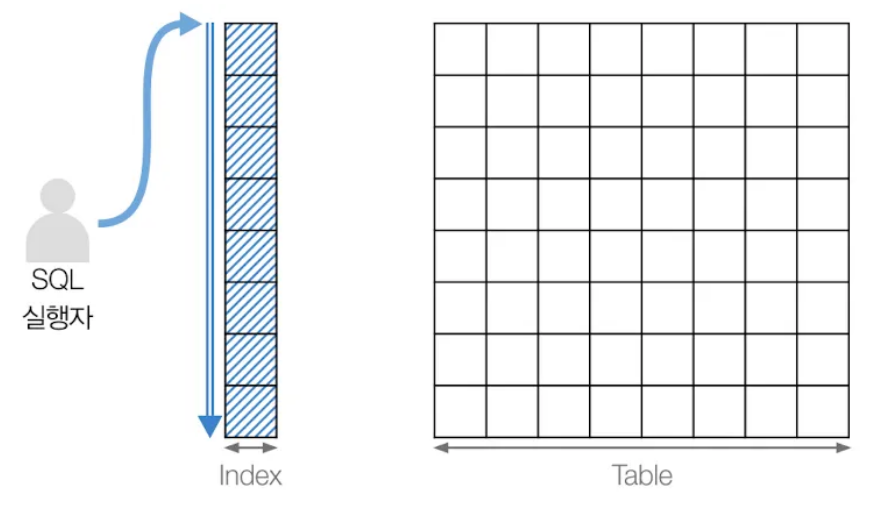
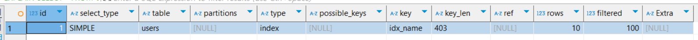

# 실행 계획(EXPAIN)을 활용해 성능 저하 요인 찾아내기
- [실행 계획(EXPAIN)을 활용해 성능 저하 요인 찾아내기](#실행-계획expain을-활용해-성능-저하-요인-찾아내기)
  - [SQL문의 '실행 계획' 사용해 보기 (EXPAIN)](#sql문의-실행-계획-사용해-보기-expain)
    - [실행 계획이란?](#실행-계획이란)
    - [실행 계획을 확인하는 방법](#실행-계획을-확인하는-방법)
    - [실행 계획 사용해보기](#실행-계획-사용해보기)
  - [실행 계획에서 `type`의미 분석하기 (ALL, index)](#실행-계획에서-type의미-분석하기-all-index)
    - [`ALL`: 풀 테이블 스캔](#all-풀-테이블-스캔)
    - [`index`: 풀 인덱스 스캔](#index-풀-인덱스-스캔)

## SQL문의 '실행 계획' 사용해 보기 (EXPAIN)
### 실행 계획이란?

- *옵티마이저가 SQL문을 어떤 방식으로 어떻게 처리할 지를 계획한 것*

### 실행 계획을 확인하는 방법
```sql
# 실행 계획 조회
EXPAIN [SQL문]

# 실행 계획에 대한 자세한 정보 조회
EXPAIN ANALYZE [SQL문]
```

### 실행 계획 사용해보기
1. 테이블 생성
    ```sql
    DROP TABLE IF EXISTS users; # 기존 테이블 삭제

    CREATE TABLE users (
        id INT AUTO_INCREMENT PRIMARY KEY,
        name VARCHAR(100),
        age INT
    );
    ```
2. 데이터 삽입
    ```sql
    INSERT INTO users (name, age) VALUES
    ('박미나', 26),
    ('김미현', 23),
    ('김민재', 21),
    ('이재현', 24),
    ('조민규', 23),
    ('하재원', 22),
    ('최지우', 22);
    ```
3. 실행 계획 조회하기
  - 실행 계획 조회하기
      ```sql
      EXPLAIN SELECT * FROM users
      WHERE age = 23;
      ```
    - `id`          : 실행계획
    - `select_type` : (처음에는 몰라도 됨)
    - `table`       : 조회한 테이블 명
    - `partitions`  : (처음에는 몰라도 됨)
    - `type`        : **테이블의 데이터를 어떤 방식으로 조회하는 지**
    - `possible_keys` : **사용할 수 있는 인덱스 목록을 출력**
    - `key`         : **데이터 조회할 때 실제로 사용한 인덱스 값**
    - `key_len`     : (처음에는 몰라도 됨)
    - `ref`         : 테이블 조인 상황에서 어떤 값을 기준으로 데이터를 조회했는 지
    - `rows`        : **SQL문 수행을 위해 접근하는 데이터의 모든 행의 수**
    - `filtered`    : 필터 조건에 따라 어느 정도의 비율로 데이터를 제거했는지 의미
      - filtered 값이 30이라면 100개의 데이터 중 30개의 데이터를 실제로 응답한 것
      - filtered 값이 낮을 수록 불필요한 데이터를 많이 불러온 것
    - `Extra`       : **부가적인 정보를 제공**
      - `using where`, `using index`
  - 실행 계획에 대한 자세한 정보 조회
      ```sql
      EXPLAIN ANALYZE SELECT * FROM users
      WHERE age = 23;
      ```
    - `Table scan on users`: users 테이블을 풀 스캔했다.
      - `rows`: 접근한 데이터 행의 수
      - `actual time=0.0437..0.0502`
        - `0.0437`: 첫 번째 데이터에 접근하기까지의 시간
        - `0.0502`: 마지막 데이터에 접근하기까지의 시간
    - `Filter: (users.age = 23)`: 필터링을 통해 데이터를 추출. 필터링 조건은 `users.age = 23`
  
## 실행 계획에서 `type`의미 분석하기 (ALL, index)
- 비효율적인 스캔 방식
- `ALL`: 모든 데이터를 스캔하여 결과를 찾는 방식
- `index`: 모든 인덱스 테이블을 스캔하여 결과를 찾는 방식
### `ALL`: 풀 테이블 스캔

- *인덱스를 활용하지 않고 테이블을 처음부터 끝까지 전부 스캔하여 데이터를 찾는 방식*
- **예제**
  1. 테이블 생성
      ```sql
      DROP TABLE IF EXISTS users; # 기존 테이블 삭제

      CREATE TABLE users (
          id INT AUTO_INCREMENT PRIMARY KEY,
          name VARCHAR(100),
          age INT
      );
      ```
  2. 더미 데이터 생성
      ```sql
      INSERT INTO users (name, age) VALUES 
      ('Alice', 30),
      ('Bob', 23),
      ('Charlie', 35);
      ```
  3. 실행 계획 조회하기
      ```sql
      EXPLAIN SELECT * FROM users WHERE age = 23; # type : ALL
      ```
      
      - `users` 테이블의 데이터는 `age`를 기준으로 정렬되어 있지 않고 `id`를 기준으로 정렬되어 있음
      - 따라서, `age = 23`을 찾기 위해서는 *Full-Table Scan*이 필요함

### `index`: 풀 인덱스 스캔

- *전체 인덱스 테이블*을 스캔하여 결과를 찾는 방식
- 풀 테이블 스캔보다는 효율적이지만 인덱스 테이블 전체를 읽어야 하므로 아주 효과적이지는 않다.
- **예제**
  1. 테이블 생성
      ```sql
      DROP TABLE IF EXISTS users; # 기존 테이블 삭제

      CREATE TABLE users (
          id INT AUTO_INCREMENT PRIMARY KEY,
          name VARCHAR(100),
          age INT
      );
      ```
  2. 더미 데이터 생성
      ```sql
      -- 높은 재귀(반복) 횟수를 허용하도록 설정
      -- (아래에서 생성할 더미 데이터의 개수와 맞춰서 작성하면 된다.)
      SET SESSION cte_max_recursion_depth = 1000000; 

      -- 더미 데이터 삽입 쿼리
      INSERT INTO users (name, age)
      WITH RECURSIVE cte (n) AS
      (
        SELECT 1
        UNION ALL
        SELECT n + 1 FROM cte WHERE n < 1000000 -- 생성하고 싶은 더미 데이터의 개수
      )
      SELECT 
          CONCAT('User', LPAD(n, 7, '0')),   -- 'User' 다음에 7자리 숫자로 구성된 이름 생성
          FLOOR(1 + RAND() * 1000) AS age    -- 1부터 1000 사이의 난수로 나이 생성
      FROM cte;
      ```
  3. 인덱스 생성
      ```sql
      CREATE INDEX idx_name ON users (name);
      ```
  4. 실행 계획 조회하기
      ```sql
      EXPLAIN SELECT * FROM users 
      ORDER BY name 
      LIMIT 10;
      ```
      
      - `name`을 기준으로 정렬해서 데이터를 가져와야 하기 때문에, `name`을 기준으로 정렬되어 있는 인덱스를 조회한다.
      - 모든 인덱스의 값을 다 불러온 뒤에 최상단 10개의 인덱스만 추출
      - 10개의 인덱스에 해당하는 데이터를 `users` 테이블에서 조회 