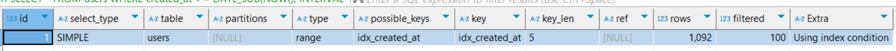

# SQL문 튜닝 연습하기
- [SQL문 튜닝 연습하기](#sql문-튜닝-연습하기)
  - [한 번에 너무 많은 데이터를 조회하는 SQL문 튜닝하기](#한-번에-너무-많은-데이터를-조회하는-sql문-튜닝하기)
  - [WHERE 문이 사용된 SQL문 튜닝하기 - 1](#where-문이-사용된-sql문-튜닝하기---1)
  - [WHERE 문이 사용된 SQL문 튜닝하기 - 2](#where-문이-사용된-sql문-튜닝하기---2)

## 한 번에 너무 많은 데이터를 조회하는 SQL문 튜닝하기
1. 테이블 생성
    ```sql  
    DROP TABLE IF EXISTS users; # 기존 테이블 삭제

    CREATE TABLE users (
        id INT AUTO_INCREMENT PRIMARY KEY,
        name VARCHAR(100),
        age INT
    );
    ```
2. 100만 건의 랜덤 데이터 삽입
```sql
-- 높은 재귀(반복) 횟수를 허용하도록 설정
-- (아래에서 생성할 더미 데이터의 개수와 맞춰서 작성하면 된다.)
SET SESSION cte_max_recursion_depth = 1000000; 

-- 더미 데이터 삽입 쿼리
INSERT INTO users (name, age)
WITH RECURSIVE cte (n) AS
(
  SELECT 1
  UNION ALL
  SELECT n + 1 FROM cte WHERE n < 1000000 -- 생성하고 싶은 더미 데이터의 개수
)
SELECT 
    CONCAT('User', LPAD(n, 7, '0')),   -- 'User' 다음에 7자리 숫자로 구성된 이름 생성
    FLOOR(1 + RAND() * 1000) AS age    -- 1부터 1000 사이의 난수로 나이 생성
FROM cte;
```
3. 데이터 조회해 보기
    - 데이터 10,000개 조회하기
      ```sql
      select * from users limit 10000;
      ```
      - 대략 `600ms` 소요
    - 데이터 10개 조회하기
      ```sql
      select * from users limit 10;
      ```
      - 대략 `200ms` 소요

- 조회하는 데이터의 개수가 줄어들 경우 소요시간도 함께 줄어듬을 확인할 수 있다.
- 실제 대부분의 서비스는 한번에 모든 데이터를 불러오는 대신 페이지네이션을 적용하여 일부 데이터만 조회한다.
- 조회하는 데이터의 개수가 성능에 많은 영향을 끼치기 때문이다.
- `LIMIT`, `WHERE` 문 등을 활용하여 조회하는 데이터의 수를 줄이는 방법을 고려해보자.

## WHERE 문이 사용된 SQL문 튜닝하기 - 1
- 최근 3일 이내에 가입한 유저 조회하기
1. 테이블 생성하기
    ```sql
    DROP TABLE IF EXISTS users; 

    CREATE TABLE users (
        id INT AUTO_INCREMENT PRIMARY KEY,
        name VARCHAR(100),
        department VARCHAR(100),
        created_at TIMESTAMP DEFAULT CURRENT_TIMESTAMP
    );
    ```
2. 100만 건의 데이터 삽압
    ```sql
    -- 높은 재귀(반복) 횟수를 허용하도록 설정
    -- (아래에서 생성할 더미 데이터의 개수와 맞춰서 작성하면 된다.)
    SET SESSION cte_max_recursion_depth = 1000000; 

    -- 더미 데이터 삽입 쿼리
    INSERT INTO users (name, department, created_at)
    WITH RECURSIVE cte (n) AS
    (
      SELECT 1
      UNION ALL
      SELECT n + 1 FROM cte WHERE n < 1000000 -- 생성하고 싶은 더미 데이터의 개수
    )
    SELECT 
        CONCAT('User', LPAD(n, 7, '0')) AS name,  -- 'User' 다음에 7자리 숫자로 구성된 이름 생성
        CASE 
            WHEN n % 10 = 1 THEN 'Engineering'
            WHEN n % 10 = 2 THEN 'Marketing'
            WHEN n % 10 = 3 THEN 'Sales'
            WHEN n % 10 = 4 THEN 'Finance'
            WHEN n % 10 = 5 THEN 'HR'
            WHEN n % 10 = 6 THEN 'Operations'
            WHEN n % 10 = 7 THEN 'IT'
            WHEN n % 10 = 8 THEN 'Customer Service'
            WHEN n % 10 = 9 THEN 'Research and Development'
            ELSE 'Product Management'
        END AS department,  -- 의미 있는 단어 조합으로 부서 이름 생성
        TIMESTAMP(DATE_SUB(NOW(), INTERVAL FLOOR(RAND() * 3650) DAY) + INTERVAL FLOOR(RAND() * 86400) SECOND) AS created_at -- 최근 10년 내의 임의의 날짜와 시간 생성
    FROM cte;

    -- 잘 생성됐는 지 확인
    SELECT COUNT(*) FROM users;
    SELECT * FROM users LIMIT 10;
    ```
3. 데이터 조회해서 성능 측정하기
    ```sql
    SELECT * FROM users
    WHERE created_at >= DATE_SUB(NOW(), INTERVAL 3 DAY);
    ```
    - 대략 `900ms`의 시간이 소요됨
4. 실행 계획 조회
    ```sql
    EXPLAIN SELECT * FROM users
    WHERE created_at >= DATE_SUB(NOW(), INTERVAL 3 DAY);
    ```
    
    - 시간은 약 `900ms`가 소요됨
    - `type=ALL`, `rows=996810`인 것을 보아, 전체 데이터를 모두 스캔하여 데이터를 찾아내는 `FULL TABLE SCAN`
    - 성능상으로 *비효율적*이다.
5. 성능 개선을 위한 인덱스 추가
    - 만약 `created_at`이 정렬되어 있다면 최근 3일 이내에 가입한 유저를 빠르게 조회할 수 있다.
    - `created_at`에 대한 인덱스를 생성해 주자
    ```sql
    CREATE INDEX idx_created_at ON users (created_at);

    SHOW INDEX FROM users;
    ```
6. 실행 계획 조회해 보기
    ```sql
    EXPLAIN SELECT * FROM users
    WHERE created_at >= DATE_SUB(NOW(), INTERVAL 3 DAY); 
    ```
    
    - 실행 시간은 `37ms`가 소요
    - `type=range`, `rows=1092` 로 **레인지 스캔(Index Range Scan)** 을 통해 빠르게 조회된 것을 확인할 수 있다.

- `WHERE`문의 `부등호(<, >, <=, >=, =)`, `IN`, `BETWEEN`, `LIKE`와 같은 곳에서 사용되는 컬럼은 인덱스를 사용했을 때 성능이 향상될 가능성이 높다.

## WHERE 문이 사용된 SQL문 튜닝하기 - 2
