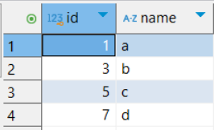

# 인덱스(Index) 기본 개념
- [인덱스(Index) 기본 개념](#인덱스index-기본-개념)
  - [인덱스(Index)란?](#인덱스index란)
    - [인덱스(Index)란?](#인덱스index란-1)
  - [인덱스 설정 및 성능 측정](#인덱스-설정-및-성능-측정)
  - [기본으로 설정되는 인덱스 - PK](#기본으로-설정되는-인덱스---pk)
  - [Unique Key 생성으로 생성되는 인덱스](#unique-key-생성으로-생성되는-인덱스)
  - [무분별한 인덱스 사용시 문제](#무분별한-인덱스-사용시-문제)

## 인덱스(Index)란?
### 인덱스(Index)란?
- 인덱스(Index)는 데이터베이스 테이블에 대한 검색 성능의 속도를 높여주는 자료 구조
- 데이터를 빨리 찾기 위해 특정 컬럼을 기준으로 미리 정렬해 놓은 표

## 인덱스 설정 및 성능 측정
1. 테이블 생성

   ```sql
   DROP TABLE IF EXISTS users; # 기존 테이블 삭제

   CREATE TABLE users (
       id INT AUTO_INCREMENT PRIMARY KEY,
       name VARCHAR(100),
       age INT
   );
   ```

2. 100만 건의 랜덤 데이터 삽입

   ```sql
   -- 높은 재귀(반복) 횟수를 허용하도록 설정
   -- (아래에서 생성할 더미 데이터의 개수와 맞춰서 작성하면 된다.)
   SET SESSION cte_max_recursion_depth = 1000000;

   -- 더미 데이터 삽입 쿼리
   INSERT INTO users (name, age)
   WITH RECURSIVE cte (n) AS
   (
     SELECT 1
     UNION ALL
     SELECT n + 1 FROM cte WHERE n < 1000000 -- 생성하고 싶은 더미 데이터의 개수
   )
   SELECT
       CONCAT('User', LPAD(n, 7, '0')),   -- 'User' 다음에 7자리 숫자로 구성된 이름 생성
       FLOOR(1 + RAND() * 1000) AS age    -- 1부터 1000 사이의 랜덤 값으로 나이 생성
   FROM cte;

   -- 잘 생성됐는 지 확인
   SELECT COUNT(*) FROM users;
   ```

3. 데이터 조회해보기

   ```sql
   SELECT * FROM USERS
   WHERE age = 23;
   ```

4. SQL 실행시 걸리는 시간 측정
   

   - 대략 `520ms` 소요

5. 인덱스 설정하기
   - 인덱스 생성
     ```SQL
     # 인덱스 생성
     # CREATE INDEX 인덱스명 ON 테이블명 (컬럼명);
     CREATE INDEX idx_age ON users(age);
     ```
   - 인덱스 조회
     ```SQL
     # SHOW INDEX FROM 테이블명;
     SHOW INDEX FROM users;
     ```

6. 데이터 다시 조회해보고 SQL 실행 소요 시간 측정
   ```SQL
   SELECT * FROM users
   WHERE age = 23;
   ```
   
   - `22ms` 소요 기존 (`520ms`) 보다 확연하게 성능이 향상됨

- index 직접 생성하게 되면 인덱스 표가 내부적으로 생성됨
- 나이를 기준으로 정렬한 표를 가지고 있기 때문에, `나이`를 기준으로 조회할 때 빠르게 찾을 수 있음

## 기본으로 설정되는 인덱스 - PK
기존의 `users` 테이블을 삭제하고 다시 생성하면서 기본 인덱스 PK에 대하여 알아보자

```sql
DROP TABLE IF EXISTS users; # 기존 테이블 삭제

CREATE TABLE users (
    id INT PRIMARY KEY,
    name VARCHAR(100)
);
```

1. 테이블에 데이터 삽입
    ```sql
    INSERT INTO users (id, name) VALUES 
    (1, 'a'),
    (3, 'b'),
    (5, 'c'),
    (7, 'd');

    SELECT * FROM users;
    ```
    
2. `id`가 `7`인 값을 `2`로 변경
    ```sql
    UPDATE users
    SET id = 2
    WHERE id = 7;

    SELECT * FROM users;
    ```
    
    - 여전히 `id` 컬럼을 기준으로 정렬되어 있는 채로 데이터가 조회된다.
    - `PK`는 인덱스의 일종이기 때문
    - 이렇게 **원본 데이터 자체가 정렬되는 인덱스**를 **클러스터링 인덱스**라고 한다.
    - `PK = 클러스터링 인덱스`라고 생각해도 좋다.
3. Index 확인하기
    ```sql
    # 특정 테이블 인덱스 조회
    # SHOW INDEX FROM 테이블명;
    SHOW INDEX FROM users; 
    ```

- **PK에는 인덱스가 기본적으로 적용**
- PK에는 인덱스가 적용되어 있으므로 **PK를 기준으로 데이터가 정렬됨**
- **클러스터링 인덱스**는 원본 데이터가 정렬되는 인덱스

## Unique Key 생성으로 생성되는 인덱스
Unique 제약 조건을 추가하면 자동으로 인덱스가 생성된다.

1. 테이블 생성
    ```sql
    DROP TABLE IF EXISTS users; # 기존 테이블 삭제

    CREATE TABLE users (
        id INT AUTO_INCREMENT PRIMARY KEY,
        name VARCHAR(100) UNIQUE
    );
    ```
2. 인덱스 확인하기
    ```sql
    $ SHOW INDEX FROM users;
    ```

- 이런 특징 때문에 UNIQUE 특징으로 인해 생성되는 인덱스를 보고 **고유 인덱스(Unique Index)**라고 부른다.
- `Unique` 옵션을 사용하면 인덱스가 같이 생성되기 때문에 조회 성능이 향상된다.

## 무분별한 인덱스 사용시 문제
- 인덱스를 사용하면 데이터를 조회할 때의 성능이 향상된다.
- 하지만 인덱스를 추가하면 쓰기 작업(삽입, 수정, 삭제)의 성능은 된다.
- 인덱스를 추가한다는 건 인덱스용 테이블이 추가적으로 생성된다는 뜻이다.
- 따라서, 원래 테이블만 수정하는 것 보다 성능이 하락하게 된다.

1. 테이블 생성하기
    ```sql
    -- 테이블 A: 인덱스가 없는 테이블
    CREATE TABLE test_table_no_index (
        id INT AUTO_INCREMENT PRIMARY KEY,
        column1 INT,
        column2 INT,
        column3 INT,
        column4 INT,
        column5 INT,
        column6 INT,
        column7 INT,
        column8 INT,
        column9 INT,
        column10 INT
    );

    -- 테이블 B: 인덱스가 많은 테이블
    CREATE TABLE test_table_many_indexes (
        id INT AUTO_INCREMENT PRIMARY KEY,
        column1 INT,
        column2 INT,
        column3 INT,
        column4 INT,
        column5 INT,
        column6 INT,
        column7 INT,
        column8 INT,
        column9 INT,
        column10 INT
    );
    ```
2. 인덱스 추가
    ```sql
    -- 각 컬럼에 인덱스를 추가
    CREATE INDEX idx_column1 ON test_table_many_indexes (column1);
    CREATE INDEX idx_column2 ON test_table_many_indexes (column2);
    CREATE INDEX idx_column3 ON test_table_many_indexes (column3);
    CREATE INDEX idx_column4 ON test_table_many_indexes (column4);
    CREATE INDEX idx_column5 ON test_table_many_indexes (column5);
    CREATE INDEX idx_column6 ON test_table_many_indexes (column6);
    CREATE INDEX idx_column7 ON test_table_many_indexes (column7);
    CREATE INDEX idx_column8 ON test_table_many_indexes (column8);
    CREATE INDEX idx_column9 ON test_table_many_indexes (column9);
    CREATE INDEX idx_column10 ON test_table_many_indexes (column10);
    ```
3. 데이터 삽입 성능 테스트
    ```sql
    -- 높은 재귀(반복) 횟수를 허용하도록 설정
    -- (아래에서 생성할 더미 데이터의 개수와 맞춰서 작성하면 된다.)
    SET SESSION cte_max_recursion_depth = 100000; 

    -- 인덱스가 없는 테이블에 데이터 10만개 삽입
    INSERT INTO test_table_no_index (column1, column2, column3, column4, column5, column6, column7, column8, column9, column10)
    WITH RECURSIVE cte AS (
        SELECT 1 AS n
        UNION ALL
        SELECT n + 1 FROM cte WHERE n < 100000
    )
    SELECT
        FLOOR(RAND() * 1000),
        FLOOR(RAND() * 1000),
        FLOOR(RAND() * 1000),
        FLOOR(RAND() * 1000),
        FLOOR(RAND() * 1000),
        FLOOR(RAND() * 1000),
        FLOOR(RAND() * 1000),
        FLOOR(RAND() * 1000),
        FLOOR(RAND() * 1000),
        FLOOR(RAND() * 1000)
    FROM cte;

    -- 인덱스가 많은 테이블에 데이터 10만개 삽입
    INSERT INTO test_table_many_indexes (column1, column2, column3, column4, column5, column6, column7, column8, column9, column10)
    WITH RECURSIVE cte AS (
        SELECT 1 AS n
        UNION ALL
        SELECT n + 1 FROM cte WHERE n < 100000
    )
    SELECT
        FLOOR(RAND() * 1000),
        FLOOR(RAND() * 1000),
        FLOOR(RAND() * 1000),
        FLOOR(RAND() * 1000),
        FLOOR(RAND() * 1000),
        FLOOR(RAND() * 1000),
        FLOOR(RAND() * 1000),
        FLOOR(RAND() * 1000),
        FLOOR(RAND() * 1000),
        FLOOR(RAND() * 1000)
    FROM cte;
    ```
    - index가 없는 테이블에 삽입시
        
    - index가 많은 테이블에 삽입시
        