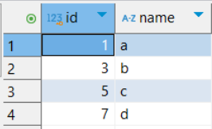
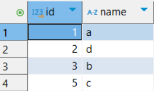

기존의 `users` 테이블을 삭제하고 다시 생성하면서 기본 인덱스 PK에 대하여 알아보자

```sql
DROP TABLE IF EXISTS users; # 기존 테이블 삭제

CREATE TABLE users (
    id INT PRIMARY KEY,
    name VARCHAR(100)
);
```

1. 테이블에 데이터 삽입
    ```sql
    INSERT INTO users (id, name) VALUES 
    (1, 'a'),
    (3, 'b'),
    (5, 'c'),
    (7, 'd');

    SELECT * FROM users;
    ```
    
2. `id`가 `7`인 값을 `2`로 변경
    ```sql
    UPDATE users
    SET id = 2
    WHERE id = 7;

    SELECT * FROM users;
    ```
    
    - 여전히 `id` 컬럼을 기준으로 정렬되어 있는 채로 데이터가 조회된다.
    - `PK`는 인덱스의 일종이기 때문
    - 이렇게 **원본 데이터 자체가 정렬되는 인덱스**를 **클러스터링 인덱스**라고 한다.
    - `PK = 클러스터링 인덱스`라고 생각해도 좋다.
3. Index 확인하기
    ```sql
    # 특정 테이블 인덱스 조회
    # SHOW INDEX FROM 테이블명;
    SHOW INDEX FROM users; 
    ```

- **PK에는 인덱스가 기본적으로 적용**
- PK에는 인덱스가 적용되어 있으므로 **PK를 기준으로 데이터가 정렬됨**
- **클러스터링 인덱스**는 원본 데이터가 정렬되는 인덱스