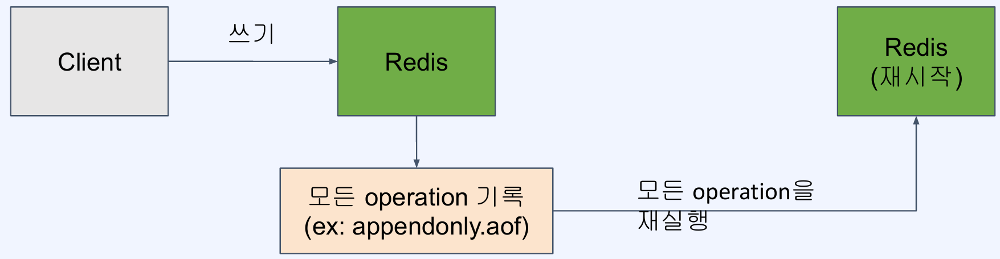
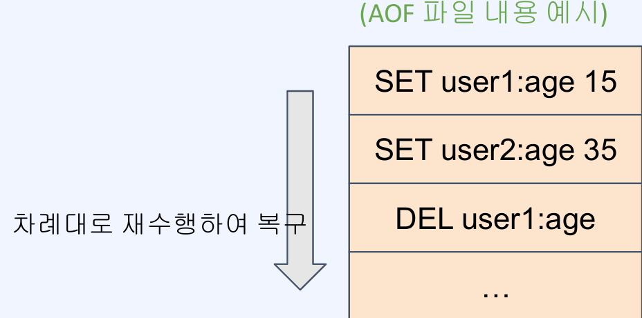

# Redis의 백업과 장애 복구
## RDB를 사용한 백업
### RDB(Redis Database)를 사용한 백업

- 특정 시점의 스냅샷으로 데이터 저장
- 재시작 시 RDB 파일이 있으면 읽어서 복구

### RDB 사용의 장점
- 작은 파일 사이즈로 백업 파일 관리가 용이 (원격지 백업, 버전 관리 등)
- fork를 이용해 백업하므로 서비스 중인 프로세스는 성능에 영향이 없음
- 데이터 스냅샷 방식이므로 빠른 복구가 가능

### RDB 사용의 단점
- 스냅샷을 저장하는 시점 사이의 데이터 변경사항은 유실될 수 있음
- fork를 이용하기 떄문에 시간이 오래 걸릴 수 있고, CPU와 메모리 자원을 많이 사용
- 데이터 무결성이나 정합성에 대한 요구가 크지 않은 경우 사용 가능 (마지막 백업 시 에러 발생 등의 문제)

### RDB 설정
- 설정 파일이 없어도 기본값으로 RDB를 활성화되어 있음
- 설정 파일을 만드려면 템플릿을 받아서 사용(https://redis.io/docs/latest/operate/oss_and_stack/management/config/)
- 저장주기 설정(ex. 60초마다 10개 이상의 변경이 있을 때 수행)
  - `save 60 10`
- 스냅샷을 저장할 파일 이름
  - `dbfilename dump.rdb`
- 수동으로 스냅샷 저장
  - `bgsave`

**Docker를 사용해 Redis 설정 파일 적용하기**
- [Redis RDB 백업 설정 실습 파일](./static/redis.conf.txt)
  - `실습RDB${번호}` 를 이용하여 검색
- `docker run` 사용시 `-v` 옵션을 이용해 디렉토리 또는 파일을 마운팅할 수 있음
- redis 이미지 실행 시 `redis-server`에 직접 redis 설정파일 겨올 지정 가능
- Docker 컨테이너 실행 시 설정 파일 적용하기
  > `docker run -v /my/redis.conf:/redis.conf --name my-redis redis redis-server /redis.conf`

## AOF를 사용한 백업
### AOF(Append Only File) 를 사용한 백업

- 모든 쓰기 요청에 대한 로그를 저장
- 재시작 시 AOF에 기록된 모든 동작을 재수행해서 데이터를 복구

### AOF 사용의 장점

- 모든 변경사항이 기록되므로 RDB 방식 대비 안정적으로 데이터 백업 가능
- AOF 파일은 `append-only` 방식이므로 백업 파일이 손상될 위험이 적음
- 실제 수행된 명령어가 저장되어 있으므로 사람이 보고 이해할 수 있고 수정도 가능

### AOF 사용의 단점
- RDB 방식보다 파일 사이즈가 커짐
- RDB 방식 대비 백업 & 복구 속도가 느림 (백업 성능은 fsync 정채겡 따라 조절 가능)

### AOF 설정
- AOF 사용 (기본값은 ON)
  > `appendonly yes`
- AOF 파일 이름
  > `appendfilename appendonly.aof`
- fsync 정책 설정 (`always`, `everysec`, `no`)
  > `appendfsync everysec`

**`fsync`** 정책 (`appendfsync 설정 값)
- `fsync()` 호출은 OS에게 데이터를 디스크에 쓰도록 함
- 가능한 옵션과 설명
  - `always`: 새로운 커맨드가 추가될 때마다 수행. 가장 안정하지만 가능 느림.
  - `everysec`: 1초마다 수행. 성능은 RDB 수준에 근접
  - `no`: OS에 맡김. 가장 빠르지만 덜 안전한 방법. (커널마다 수행 시간이 다를 수 있음)

**AOF 관련 개념**
- `Log rewriting`: 최종 상태를 만들기 위한 최소한의 로그만 남기기 위해 일부를 새로 씀
  - (Ex: 1개의 key값을 100번 수정해도 최종 상태는 1개이므로 SET 1개로 대체 가능)
- `Multi Part AOF`: Redis 7.0 부터 AOF가 단일 파일에 저장되지 않고 여러 개가 사용됨
  - `base file`: 마지막 `rewrite` 시의 스냅샷을 저장
  - `incremental file`: 마지막으로 base file이 생성된 이후의 변경사항이 쌓임
  - `manifest file`: 파일들을 관리하기 위한 메타 데이터를 저장

**AOF 실습**
- [Redis Conf AOF 실습](./static/redis.conf.txt)
- `실습AOF${번호}` 로 검색