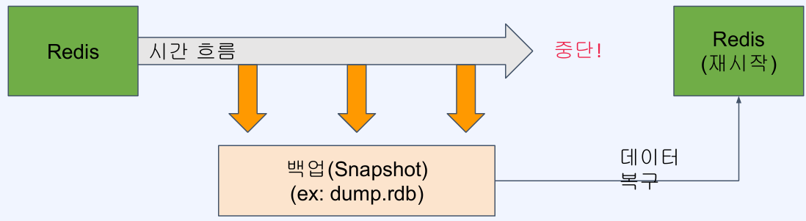

# Redis의 백업과 장애 복구
## RDB를 사용한 백업
### RDB(Redis Database)를 사용한 백업

- 특정 시점의 스냅샷으로 데이터 저장
- 재시작 시 RDB 파일이 있으면 읽어서 복구

### RDB 사용의 장점
- 작은 파일 사이즈로 백업 파일 관리가 용이 (원격지 백업, 버전 관리 등)
- fork를 이용해 백업하므로 서비스 중인 프로세스는 성능에 영향이 없음
- 데이터 스냅샷 방식이므로 빠른 복구가 가능

### RDB 사용의 단점
- 스냅샷을 저장하는 시점 사이의 데이터 변경사항은 유실될 수 있음
- fork를 이용하기 떄문에 시간이 오래 걸릴 수 있고, CPU와 메모리 자원을 많이 사용
- 데이터 무결성이나 정합성에 대한 요구가 크지 않은 경우 사용 가능 (마지막 백업 시 에러 발생 등의 문제)

### RDB 설정
- 설정 파일이 없어도 기본값으로 RDB를 활성화되어 있음
- 설정 파일을 만드려면 템플릿을 받아서 사용(https://redis.io/docs/latest/operate/oss_and_stack/management/config/)
- 저장주기 설정(ex. 60초마다 10개 이상의 변경이 있을 때 수행)
  - `save 60 10`
- 스냅샷을 저장할 파일 이름
  - `dbfilename dump.rdb`
- 수동으로 스냅샷 저장
  - `bgsave`

**Docker를 사용해 Redis 설정 파일 적용하기**
- [Redis RDB 백업 설정 실습 파일](./static/redis.conf.txt)
  - `실습${번호}` 를 이용하여 검색
- `docker run` 사용시 `-v` 옵션을 이용해 디렉토리 또는 파일을 마운팅할 수 있음
- redis 이미지 실행 시 `redis-server`에 직접 redis 설정파일 겨올 지정 가능
- Docker 컨테이너 실행 시 설정 파일 적용하기
  > `docker run -v /my/redis.conf:/redis.conf --name my-redis redis redis-server /redis.conf`