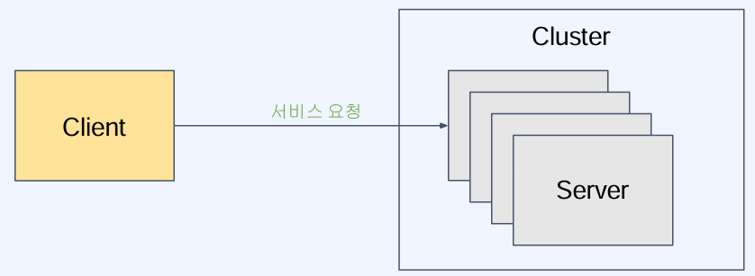
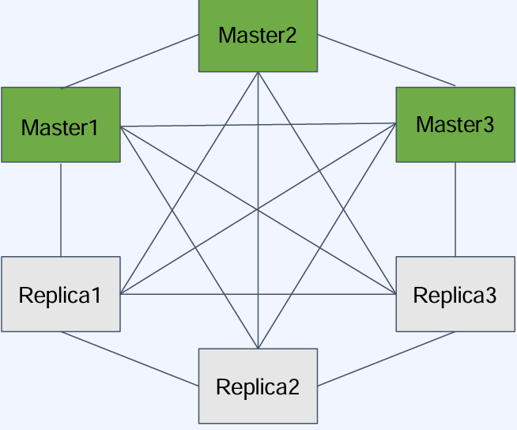
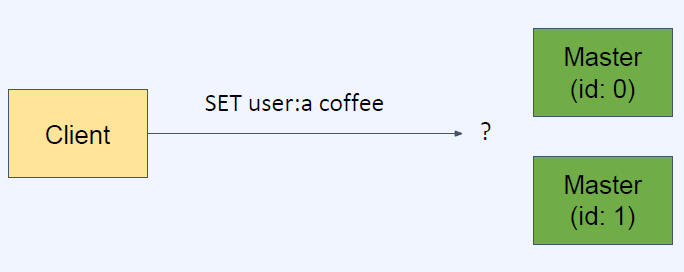
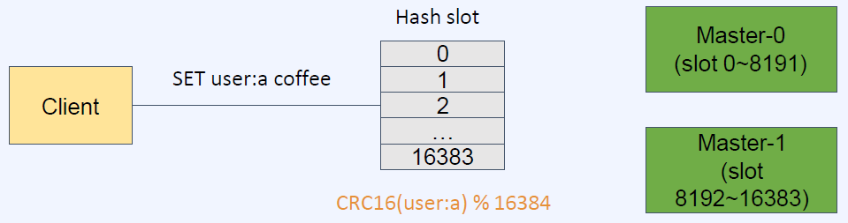
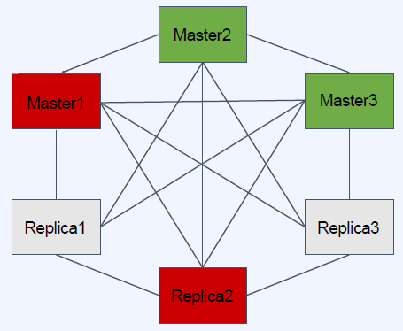
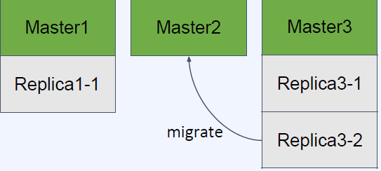

# 안정성과 가용성을 위한 클러스터
- [안정성과 가용성을 위한 클러스터](#안정성과-가용성을-위한-클러스터)
  - [확장성과 분산](#확장성과-분산)
    - [수평 확장(scale-out)](#수평-확장scale-out)
    - [분산 시스템에 따라오는 문제](#분산-시스템에-따라오는-문제)
    - [분산 시스템의 적용](#분산-시스템의-적용)
  - [Redis Cluster 소개](#redis-cluster-소개)
    - [Redis Cluster 특징](#redis-cluster-특징)
    - [Sentinel과의 차이점](#sentinel과의-차이점)
  - [데이터 분산과 key관리](#데이터-분산과-key관리)
    - [Hash Slot을 이용한 데이터 분산](#hash-slot을-이용한-데이터-분산)
    - [클라이언트의 데이터 접근](#클라이언트의-데이터-접근)
  - [성능과 가용성](#성능과-가용성)
    - [클러스터를 사용할 때의 성능](#클러스터를-사용할-때의-성능)
    - [클러스터의 데이터 일관성](#클러스터의-데이터-일관성)
    - [클러스터의 가용성 - `auto failover`](#클러스터의-가용성---auto-failover)
    - [클러스터의 가용성 - `replica migration`](#클러스터의-가용성---replica-migration)

## 확장성과 분산
**확장성이란?**

- 소프트웨어나 서비스의 요구사항 수준이 증가할 때 대응할 수 있는 능력
- 주로 규모에 대한 확장성을 뜻함(데이터 크기, 요청 트래픽 등)
- 수직 확장(`scale-up`)과 수평 확장(`scale-out`)이 사용됨

### 수평 확장(scale-out)

- 처리 요소(ex: 서버)를 여러개 두어서 작업을 분산
- 무중단 확장이 가능
- 이론적으로는 무한대로 확장이 가능

### 분산 시스템에 따라오는 문제
- 부분 장애
- 네트워크 실패
- 데이터 동기화
- 로드밸런싱 (또는 discovery)
- 개발 및 관리의 복잡성

### 분산 시스템의 적용
- 분산 시스템으로 인한 trade-off를 판단해서 적합하다면 사용
- 서비스 복잡도와 규모의 증가로 분산은 피할 수 없는 선택
- 분산 시스템의 구현체들은 세부적인 부분에서 튜닝이 가능하게 옵션이 제공됨
  - 즉, 분산 시스템의 장단점을 세부적으로 조절 가능

## Redis Cluster 소개
**Redis Cluster란?**
- Redis Cluster가 제공하는 것
  - 여러 노드에 자동적인 데이터 분산
  - 일부 노드의 실패나 통신 단절에도 계속 작동하는 가용성
  - 고성능을 보장하면서 선형 확장성을 제공

### Redis Cluster 특징

- `full-mesh` 구조로 통신
- `cluster bus` 라는 추가 채널 (port) 사용
- `gossip protocol` 사용
- `hash slot`을 사용한 키 관리
- DB0만 사용 가능
- `multi key` 명령어가 제한됨
- 클라이언트는 모든 노드에 접속

### Sentinel과의 차이점
- 클러스터는 데이터 분산(샤딩)을 제공함
- 클러스터는 자동 장애조치를 위한 모니터링 노드 (Sentinel)를 추가 배치할 필요가 없음
- 클러스터에서는 `multikey` 오퍼레이션이 제한됨
- `Sentinel`은 비교적 단순하고 소규모의 시스템에서 HA(고가용성)가 필요할 때 채택

## 데이터 분산과 key관리

- 특정 key의 데이터가 어느 노드(shard)에 속할 것인지 결정하는 메커니즘이 있어야 함
- 보통 분산 시스템에선는 해싱이 사용됨
- 단순 해싱으로는 노드의 개수가 변할 때 모든 매핑이 새로 계산되어야 하는 문제가 있음

### Hash Slot을 이용한 데이터 분산

- Redis는 `16384`의 hash slot으로 key 공간을 나누어 관리
- 각 키는 `CRC16` 해싱 후 16384로 modulo 연산을 해 각 hash slot에 매핑
- hash slot은 각 노드들에게 나누어 분배됨
- 노드가 추가되는 경우 변경이 필요한 hash slot에 위치한 key만 영향을 받고 나머지는 받지 않기 떄문에 overhead가 최소화 됨

### 클라이언트의 데이터 접근

- 클러스터 노드는 요청이 온 key에 해당하는 노드로 자동 `redirect`를 해주지 않음
- 클라이언트는 `MOVED` 에러를 받으면 해당 노드로 다시 요청해야 함
- 클라이언트의 재시도가 요구되는 경우는 많지 않음 클라이언트가 key의 위치를 캐싱해두고 있기 떄문

## 성능과 가용성
### 클러스터를 사용할 때의 성능
- 클라이언트가 `MOVED`에러에 대해 재요청을 해야 하는 문제
  - 클라이언트(라이브러리)는 `key-node` 맵을 캐싱하므로 대부분의 경우 발생하지 않음.
- 클라이언트는 단일 인스턴스 Redis를 이용할 떄와 같은 성능으로 이용 가능
- 분산 시스템에서의 성능은 데이터 일관성(`consistency`)과 `trade-off` 가 있음.
  - Redis Cluster는 고성능의 확장성을 제공하면서 적절한 수준의 데이터 안정성과 가용성을 유지하는 것을 목표로 설계됨

### 클러스터의 데이터 일관성

- Redis Cluster는 strong consistency를 제공하지 않음
- 높은 성능을 위해 비동기 복제를 하기 떄문
- Ack 와 복제는 순서가 정해져 있지 않으므로, 복제가 완료되기 전에 master가 죽으면 데이터는 유실된다.

### 클러스터의 가용성 - `auto failover`
- 일부 노드(master)가 실패(또는 네트워크 단절)하더라도 과반수 이상의 master가 남아있고, 사라진 master의 replica들이 있다면 클러스터는 failover 되어 가용한 상태가 된다.
- node timeout 동안 과반수의 master와 통신하지 못한 master는 스스로 `error status`로 빠지고 write 요청을 받지 않음

- 예) `master1` 과 `replica2`가 죽더라도, `2/3`의 master가 남아있고, master1이 커버하던 hash slot은 replica1이 master로 승격되어 커버할 수 있다.

### 클러스터의 가용성 - `replica migration`
- replica가 다른 master로 migrate 해서 가용성을 높인다.

- master3는 replica 1개를 뺴도 1개가 남기 떄문에 replica3-2는 다른 master로 migrate 가능
- 이러한 기능은 레디스 설정을 통해 변경 가능함
