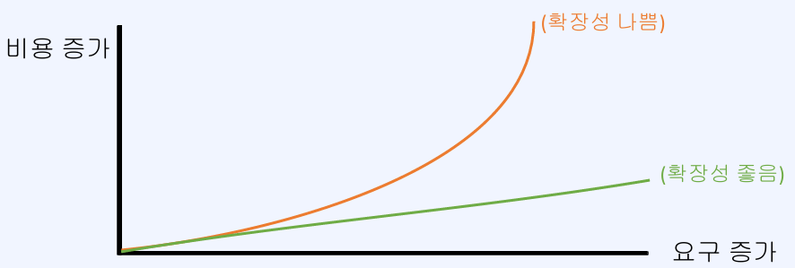

# 안정성과 가용성을 위한 클러스터
- [안정성과 가용성을 위한 클러스터](#안정성과-가용성을-위한-클러스터)
  - [확장성과 분산](#확장성과-분산)
    - [수평 확장(scale-out)](#수평-확장scale-out)
    - [분산 시스템에 따라오는 문제](#분산-시스템에-따라오는-문제)
    - [분산 시스템의 적용](#분산-시스템의-적용)
  - [Redis Cluster 소개](#redis-cluster-소개)

## 확장성과 분산
**확장성이란?**

- 소프트웨어나 서비스의 요구사항 수준이 증가할 때 대응할 수 있는 능력
- 주로 규모에 대한 확장성을 뜻함(데이터 크기, 요청 트래픽 등)
- 수직 확장(`scale-up`)과 수평 확장(`scale-out`)이 사용됨

### 수평 확장(scale-out)

- 처리 요소(ex: 서버)를 여러개 두어서 작업을 분산
- 무중단 확장이 가능
- 이론적으로는 무한대로 확장이 가능

### 분산 시스템에 따라오는 문제
- 부분 장애
- 네트워크 실패
- 데이터 동기화
- 로드밸런싱 (또는 discovery)
- 개발 및 관리의 복잡성

### 분산 시스템의 적용
- 분산 시스템으로 인한 trade-off를 판단해서 적합하다면 사용
- 서비스 복잡도와 규모의 증가로 분산은 피할 수 없는 선택
- 분산 시스템의 구현체들은 세부적인 부분에서 튜닝이 가능하게 옵션이 제공됨
  - 즉, 분산 시스템의 장단점을 세부적으로 조절 가능

## Redis Cluster 소개
**Redis Cluster란?**
- Redis Cluster가 제공하는 것
  - 여러 노드에 자동적인 데이터 분산
  - 일부 노드의 실패나 통신 단절에도 계속 작동하는 가용성
  - 고성능을 보장하면서 선형 확장성을 제공

**Redis Cluster 특징**

- `full-mesh` 구조로 통신
- `cluster bus` 라는 추가 채널 (port) 사용
- `gossip protocol` 사용
- `hash slot`을 사용한 키 관리
- DB0만 사용 가능
- `multi key` 명령어가 제한됨
- 클라이언트는 모든 노드에 접속

**Sentinel과의 차이점**
- 클러스터는 데이터 분산(샤딩)을 제공함
- 클러스터는 자동 장애조치를 위한 모니터링 노드 (Sentinel)를 추가 배치할 필요가 없음
- 클러스터에서는 `multikey` 오퍼레이션이 제한됨
- `Sentinel`은 비교적 단순하고 소규모의 시스템에서 HA(고가용성)가 필요할 때 채택
