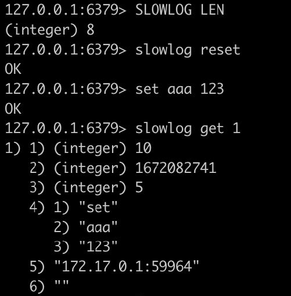

# Redis 성능 튜닝
- [Redis 성능 튜닝](#redis-성능-튜닝)
  - [적절한 Eviction 정책 설정하기](#적절한-eviction-정책-설정하기)
    - [Eviction 정책이란?](#eviction-정책이란)
    - [Redis의 메모리 관리](#redis의-메모리-관리)
    - [maxmemory-policy 옵션](#maxmemory-policy-옵션)
  - [시스템 튜닝](#시스템-튜닝)
    - [Redis 성능 측정 (redis-benchmark)](#redis-성능-측정-redis-benchmark)
    - [Redis 성능에 영향을 미치는 요소들](#redis-성능에-영향을-미치는-요소들)
    - [성능에 영향을 미치는 Redis 설정](#성능에-영향을-미치는-redis-설정)
  - [SLOWLOG를 이용한 쿼리 튜닝](#slowlog를-이용한-쿼리-튜닝)
    - [SLOWLOG 설정](#slowlog-설정)

## 적절한 Eviction 정책 설정하기
### Eviction 정책이란?
- 메모리가 한계에 도달했을 때 어떤 조치가 일어날지 결정
- 처음부터 메모리가 부족한 상황을 만들지 않는 것이 중요함
- 캐시로 사용할 때는 적절한 `eviction policy`가 사용될 수 있음

### Redis의 메모리 관리
- Memory 사용 한도 설정 => 지정하지 않으면 32bit에서는 3GB, 64bit에서는 0(무제한)으로 설정됨
    ```
    maxmemory 100mb
    ```
- `maxmemory` 도달한 경우 `eviction` 정책 설정
    ```
    maxmemory-policy noeviction
    ```

### maxmemory-policy 옵션
| 옵션              | 설명                                                                                    |
| ----------------- | --------------------------------------------------------------------------------------- |
| `noeviction`      | evction 없음. 추가 데이터는 저장되지 않고 에러 발생(replication 사용시 master에 적용됨) |
| `allkeys-lru`     | 가장 최근에 사용된 키들을 남기고 나머지를 삭제(LRU: Least Recently Used)                |
| `allkeys-lfu`     | 가장 빈번하게 사용된 키들을 남기고 나머지를 삭제(LFU: Least Frequently Used)            |
| `volatile-lru`    | LRU를 사용하되 expire field가 true로 설정된 항목들 중에서만 삭제                        |
| `volatile-lfu`    | LFU를 사용하되 expire field가 true로 설정된 항목들 중에서만 삭제                        |
| `allkeys-random`  | 랜덤하게 삭제                                                                           |
| `volatile-random` | expire field가 true로 설정된 항목들 중에서 랜덤하게 삭제                                |
| `volatile-ttl`    | expire field가 true로 설정된 항목들 중에서 짧은 TTL 순으로 삭제                         |

## 시스템 튜닝
### Redis 성능 측정 (redis-benchmark)
- redis-benchmark 유틸리티를 이용해 Redis의 성능을 측정할 수 있음
    ```
    redis-benchmark [-h host] [-p port] [-c client] [-n requests]
    ```
    - ex) `redis-benchmark -c 100 -n 100 -t SET`

### Redis 성능에 영향을 미치는 요소들
- Network bandwidth & latency: Redis의 throughput은 주로 network에 의해 결정되는 경우가 많음. 운영환경에 런치하기 전에 배포 환경의 network 대역폭과 실제 throughput을 체크하는 것이 좋음.
- CPU: 싱글 스레드로 동작하는 Redis 특정 상 CPU 성능이 중요. 코어 수보다는 큰 cache를 가진 빠른 CPU가 선호됨
- RAM속도 & 대역폭: 10KB 이하 데이터 항목들에 대해서는 큰 영향이 없음.
- 가상화 환경의 영향: VM에서 실행되는 경우 개별적인 영향이 있을 수 있음 (non-local disk, 오래된 hypervisor의 느린 fork 구현 등)

### 성능에 영향을 미치는 Redis 설정
- `rdbcompression <yes/no>`: RDB 파일을 압축할지 여부로, CPU를 절약하고 싶은 경우 no 선택
- `rdbchecksum <yes/no>`: 사용시 RDB의 안정성을 높일 수 있으나 파일 저장/로드 시에 10% 정도의 성능 저하가 있음
- `save`: RDB 파일 생성시 시스템 자원이 소모되므로 성능이 영향이 있음

## SLOWLOG를 이용한 쿼리 튜닝
### SLOWLOG 설정

- 수행 시간이 설정한 기준 시간 이상인 쿼리의 로그를 보여줌
- 측정 기준인 수행시간은 I/O 동작을 제외함
- 로깅되는 기준 시간 (microseconds)
  - `slowlog-log-slower-than 10000`
- 로그 최대 길이
  - `slowlog-max-len 128`
- slowlog 개수 확인
  - `slowlog len`
- slowlog 조회
  - `slowlog get [count]`
  - `1) 일련변호`, `2) 시간`, `3) 소요시간`, `4) 명령어`, `5) 클라이언트IP`, `6) 클라이언트 이름`

