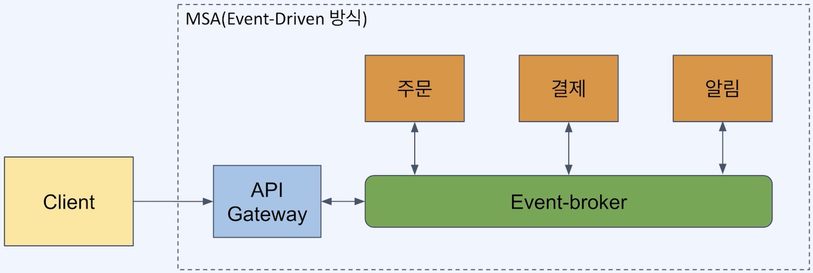

# Redis Streams를 이용한 Event-Driven 아키텍처
- [Redis Streams를 이용한 Event-Driven 아키텍처](#redis-streams를-이용한-event-driven-아키텍처)
  - [MSA와 Event-Driven 아키텍처](#msa와-event-driven-아키텍처)
    - [MSA(Microservice Architecture)는 무엇인가](#msamicroservice-architecture는-무엇인가)
    - [MSA로 얻으려는 것](#msa로-얻으려는-것)
    - [MSA의 단점](#msa의-단점)
    - [Event-Driven 아키텍처란?](#event-driven-아키텍처란)
    - [Event-Driven 아키텍처의 모습](#event-driven-아키텍처의-모습)
    - [Event-Driven 아키텍처의 장점](#event-driven-아키텍처의-장점)
    - [Event-Driven 아키텍처의 단점](#event-driven-아키텍처의-단점)

## MSA와 Event-Driven 아키텍처
### MSA(Microservice Architecture)는 무엇인가
- 시스템을 독립적인 단위의 작은 서비스들로 분리 (크기보다는 **독립성**이 중요)
  - 독립적인 단위: 다른 서비스와 다른 이유로 변경되고, 다른 속도로 변경되는 단위
  - 각 서비스들이 사용하는 DB도 분리
  - 각 서비스들은 API(인터페이스)를 통해서만 통신(다른 서비스의 DB 접근 불가)
- 기존의 Monolithic 아키텍처
  - 모든 기능들이 한 서버 안에 들어가 있고, 공유 데이터베이스를 사용
- MSA 아키텍처
  - 기능 별로(도메인 별로) 서버가 나뉘어 있고, 각자의 데이터베이스를 사용하며, API를 이용해 통신

### MSA로 얻으려는 것
- 모듈성 (높은 응집도, 낮은 결합도)
- 서비스 별로 독립적인 개발과 배포가 가능
- 서비스(코드) 크기가 작아져 이해가 쉽고 유지보수가 용이함
- 더 빠른 개발, 테스트, 배포
- 확장성(서비스 별로 개발 확장이 가능)
- 결함 격리 (일부 서비스 실패가 전체 시스템 실패로 이어지지 않음)

### MSA의 단점
- 분산 시스템의 단점을 그대로 가짐
- 통합 테스트 어려움
- 모니터링과 디버깅의 복잡도 증가
- 트랜잭션 관리의 어려움
- 서비스간 통신 구조에 대한 고민이 필요
  - 동기 vs 비동기, 프로토콜, 통신 브로커 사용 등

### Event-Driven 아키텍처란?
- 분산 시스템에서의 통신 방식을 정의한 아키텍처로, 이벤트의 생성/소비 구조로 통신이 이루어짐
- 각 서비스들은 이벤트 저장소인 Event-broker와의 의존성만 가짐

### Event-Driven 아키텍처의 모습

- 각 서버들은 Event Broker에 이벤트를 생산/소비함으로써 통신

### Event-Driven 아키텍처의 장점
- 이벤트 생산자/소비자 간의 결합도가 낮아짐 (공통적인 Event-broker에 대한 결합만 있음)
- 생산자/소비자의 유연한 변경 (서버 추가, 삭제시에 다른 서버를 변경할 필요가 적어짐)
- 장애 탄력성 (이벤트를 소비할 일부 서비스에 장애가 발생해도 이벤트는 저장되고 이후에 처리됨)

### Event-Driven 아키텍처의 단점
- 시스템의 예측 가능성이 떨어짐 (느슨하게 연결된 상호 작용에서 기인함)
- 테스트의 어려움
- 장애 추적의 어려움
