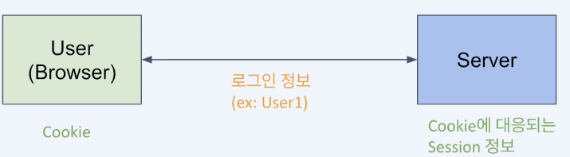
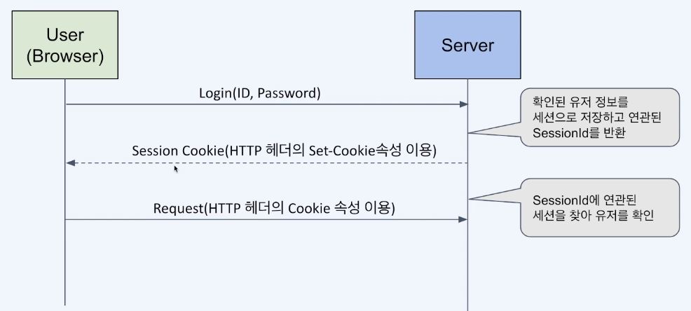
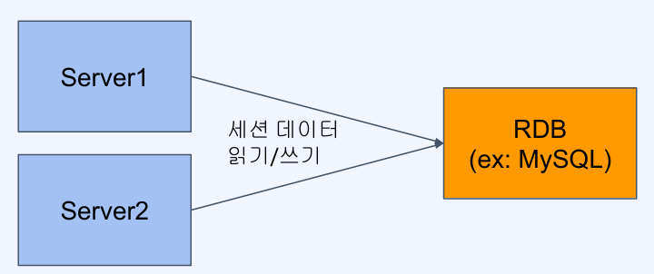
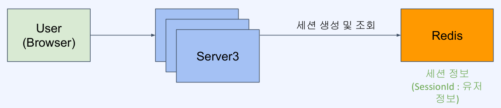
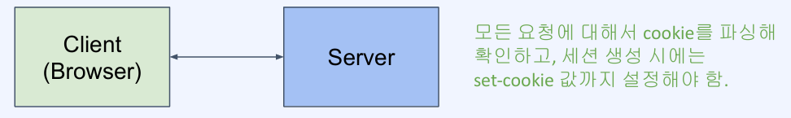
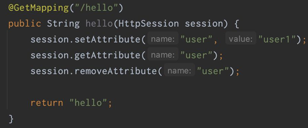
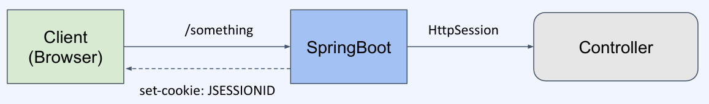

# 분산 환경에서의 세션 스토어 만들기
- [분산 환경에서의 세션 스토어 만들기](#분산-환경에서의-세션-스토어-만들기)
  - [세션이란?](#세션이란)
    - [Session](#session)
    - [Web 로그인 세션](#web-로그인-세션)
    - [분산 환경에서의 세션 처리](#분산-환경에서의-세션-처리)
  - [SpringBoot에서의 세션 관리](#springboot에서의-세션-관리)
    - [세션 관리를 위한 서버의 역할](#세션-관리를-위한-서버의-역할)

## 세션이란?
### Session
- 네트워크 상에서 두 개 이상의 통신장치간에 유지되는 상호 연결
- 연결된 일정 시간 동안 유지되는 정보를 나타냄
- 적용 대상에 따라 다른 의미를 가짐

### Web 로그인 세션

- Web 상에서 특정 유저가 로그인했음을 나타내는 정보
- 브라우저는 Cookie를, 서버는 해당 Cookie에 연관된 세션 정보를 저장한다.
- 유저가 로그아웃하거나 세션이 만료될 때까지 유지되어 유저에 특정한 서비스 가능

### 분산 환경에서의 세션 처리

- Server는 세션 정보를 저장해야 함
- Server가 여러 대라면 최초 로그인한 Server가 아닌 Server는 세션 정보를 알지 못함
- 세션 정보를 Server간에 공유할 방법이 필요 (Session Clustering)

**분산 환경에서의 세션 처리 - RDB 사용**

- 관계형 데이터 모델이 필요한가? `No`
- 영속성이 필요한 데이터인가? `No`
- 성능 요구사항을 충족하는가? `No`

**분산 환경에서의 세션 처리 - Redis 사용**

- 세션 데이터는 단순 key-value 구조
- 세션 데이터는 영속성이 필요 없음
- 세션 데이터는 변경이 빈번하고 빠른 엑세스 속도가 필요

## SpringBoot에서의 세션 관리
### 세션 관리를 위한 서버의 역할

- 세션 생성: 요청이 들어왔을 때 세션이 없다면 만들어서 응답에 set-cookie 로 넘겨줌
- 세션 이용: 요청이 들어왔을 때 세션이 있다면 해당 세션의 데이터를 가져옴
- 세션 삭제: 타임아웃이나 명시적인 로그아웃 API를 통해 세션을 무효화 함

**HttpSession**
- 세션을 손쉽게 생성하고 관리할 수 있게 해주는 인터페이스
- UUID로 세션 ID를 생성
- `JSESSIONID`라는 이름의 cookie를 설정해 내려줌
- Spring boot의 세션 관리 Interface
  
- Spring boot - Client 세션
  
