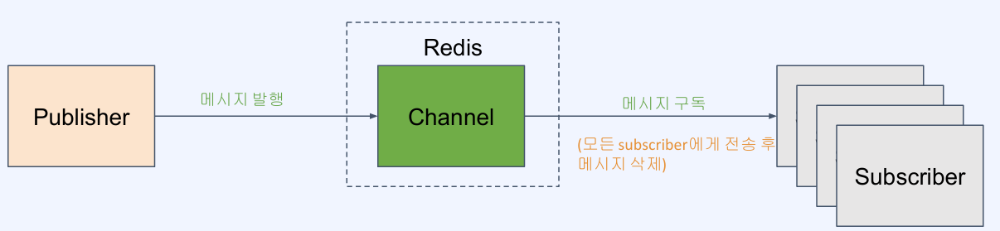

# Pub/Sub을 이용해 손쉽게 채팅방 기능 구현하기
- [Pub/Sub을 이용해 손쉽게 채팅방 기능 구현하기](#pubsub을-이용해-손쉽게-채팅방-기능-구현하기)
  - [Pub-Sub 패턴의 이해](#pub-sub-패턴의-이해)
    - [Redis의 Pub/Sub 특징](#redis의-pubsub-특징)
    - [Redis의 Pub/Sub의 유즈케이스](#redis의-pubsub의-유즈케이스)
  - [Redis Pub-Sub을 이용한 채팅방 구현](#redis-pub-sub을-이용한-채팅방-구현)
    - [실습](#실습)
## Pub-Sub 패턴의 이해

- 메시징 모델 중의 하나로 발행(Publish)과 구독(Subscribe) 역할로 개념화한 형태
- 발행자와 구독자는 서로에 대한 정보 없이 특정 주제 (토픽 or 채널)를 매개로 송수신

**메시징 미들웨어 사용의 장점**
- 비동기: 통신의 비동기 처리
- 낮은 결합도: 송신자와 수신자가 직접 서로 의존하지 않고 공통 미들웨어에 의존
- 탄력성: 구성원들간에 느슨한 연결로 인해 일부 장애가 생겨도 영향이 최소화됨
- 메시징 미들웨어 제품들: `Kafka`, `RabbitMQ`, `ActiveMQ`

### Redis의 Pub/Sub 특징

- 메시지가 큐에 저장되지 않음
- Kafka의 컨슈머 그룹같은 분산처리 개념이 없음
- 메시지 발행시 push 방식으로 subscriber들에게 전송
- subscriber가 늘어날수록 성능이 저하

### Redis의 Pub/Sub의 유즈케이스
- 실시간으로 빠르게 전송되어야 하는 메시지
- 메시지 유실을 감내할 수 있는 메시지
- 최대 1회 전송 (at-most-once) 패턴이 적합한 경우
- Subscriber 들이 다양한 채널을 유동적으로 바꾸면서 한시적으로 구독하는 경우

## Redis Pub-Sub을 이용한 채팅방 구현
**채팅방 기능의 요구사항**

- 채팅 클라이언트와 채팅 서버가 존재하고 통신 방식을 정해야 함 (프로토콜)
- 채팅 서버는 채팅방 관리 로직을 작성해야 함

**Redis Pub/Sub을 이용한 채팅방 구현**

- 채팅방 기능을 `publish/subscribe` 구조를 이용해 쉽게 구현

### 실습
- [Spring Redis Chatting 실습](./spring-redis-chatting/)