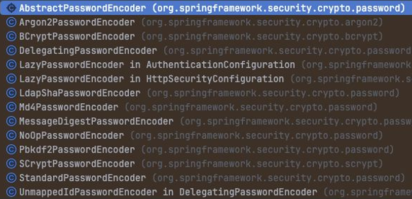

# Spring Security의 인증 공급자 계층
## UserDetailsService
스프링 시큐리티 아키텍처에서 사용자 세부 정보 서비스를 제공하는 역할  

**`UserDetailsService`를 구현하는 구현체가 사용자에 대한 정보를 관리**
- 스프링 시큐리티에서 제공하는 기본 구현체는 내부 메모리 (InMemory)에 기본 자격 증명을 등록함
- 기본 자격 증명의 사용자 이름으로 `user`를 사용함
- `user`는 스프링 컨텍스트가 로드될 때, 자동으로 생성됨
- 내부 메모리에서 자격 증명을 관리하는 것은 절대로 운영 환경에서는 사용되지 않아야 하는 방법이며 단순히 `UserDetailsService`가 어떻게 동작하는지를 보여주기 위한 개념적인 구현체임

```java
public interface UserDetailsService {
  UserDetails loadUserByUsername(String username) throws UsernameNotFoundException;
}
```

- `UserDetailsService`에는 `InMemoryUserDetailsService` 구현체가 존재하며 입력한 유저 정보가 `User` 객체로 반환됨

## PasswordEncoder
`PasswordEncoder`는 크게 두 가지 역할을 수행
```java
public interface PasswordEncoder {
    String encode(CharSequence rawPassword);
    boolean matches(CharSequence rawPassword, String encodedPassword);
    default boolean upgradeEncoding(String encodedPassword) { return false; }
}
```
- 암호를 인코딩
- 암호가 기존 인코딩과 일치하는지 확인
- 인증을 위한 다양한 `PasswordEncoder`를 지원
  

## AuthenticationProvider
```java
@Component
public class CustomAuthenticationProvider extends AuthenticationProvider {
  @Override
  public Authentication authenticate(Authentication authentication) throws AuthenticationException {
    String username = authentication.getName();
    String password = String.valueOf(authentication.getCredentials());

    if (username in "등록된 아이디" && password is "일치하는 패스워드") {
      return new UsernamePasswordAuthentication(username, password, List.of()); // List.of 내에는 유저의 권한 정보
    }

    throw new RuntimesException("Auth Error");
  }

  @Override
  public boolean supports(Class<?> authentication) {
    return UsernamePasswordAuthenticationToken.class.isAssignableFrom(authentication);
  }
}
```
- `CustomAuthenticationProvider`는 `AuthenticationProvider`를 상속받아 구현함
- `CustomAuthenticationProvider`는 `@Component` 어노테이션으로 스프링 빈으로 등록함
- `config` 패키지 하위에 생성
- 인증 로직을 구현하기 위해 `if` 문을 추가