# JPA N+1 문제
JPA N+1 문제는 성능 문제로, 특정 엔티티를 조회할 때 연관된 엔티티를 반복적으로 조회하면서 많은 쿼리가 실행되는 현상  
많은 쿼리를 발생하므로 성능 문제가 발생한다.
- 기본적으로 **N+1** 문제는 1개의 쿼리로 부모 엔티티를 조회한 후, 각 부모 엔티티와 연관된 자식 엔티티를 조회하기 위해 N개의 추가 쿼리가 실행되면서 발생함
- 해결 방법으로는 `Fetch Join`, `@EntityGraph`, `Batch Size 설정` 등이 있음
- 다음의 실습을 살펴 보면서 **N+1** 발생 케이스와 해결 방법을 알아보자

## N+1 문제가 발생하는 경우
### EAGER 로 연관관계 설정
```java
@Data
@Entity
@NoArgsConstructor
@AllArgsConstructor
@Table(name = "parties")
public class Party {
    @Id
    @GeneratedValue(strategy = GenerationType.IDENTITY)
    @Column(name = "party_id")
    private Long id;
    private String name;
    @OneToMany(mappedBy = "party", fetch = FetchType.EAGER, cascade = CascadeType.ALL)
    private List<Person> people = new ArrayList<>();
}
```
- 하위 연관 관계 조회 X
  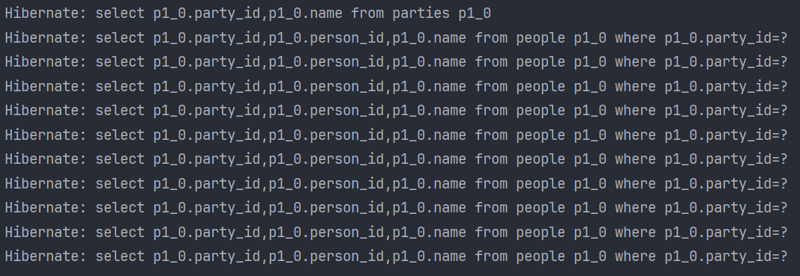
- 하위 연관 관계 조회 O
  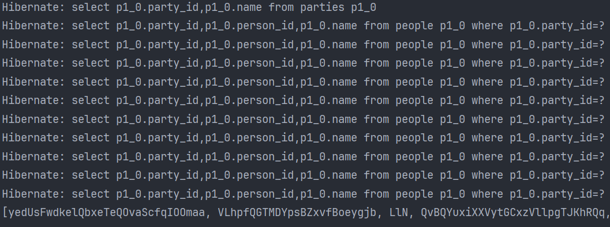

> 하위 연관 관계 조회 유무와 상관 없이 **N+1** 문제 발생

### LAZY 로 연관관계 설정
```java
@Data
@Entity
@NoArgsConstructor
@AllArgsConstructor
@Table(name = "members")
public class Member {
    @Id
    @GeneratedValue(strategy = GenerationType.IDENTITY)
    @Column(name = "member_id")
    private Long id;
    private String name;
    @OneToMany(mappedBy = "member", fetch = FetchType.LAZY, cascade = CascadeType.ALL)
    private List<Order> orders = new ArrayList<>();
}
```

- 하위 연관 관계 조회 X
  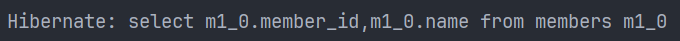
  하위 연관 관계를 조회 하지 않는 경우 N+1 문제가 발생하지는 않지만 하위 데이터 접근 불가
- 하위 연관 관계 조회 O
  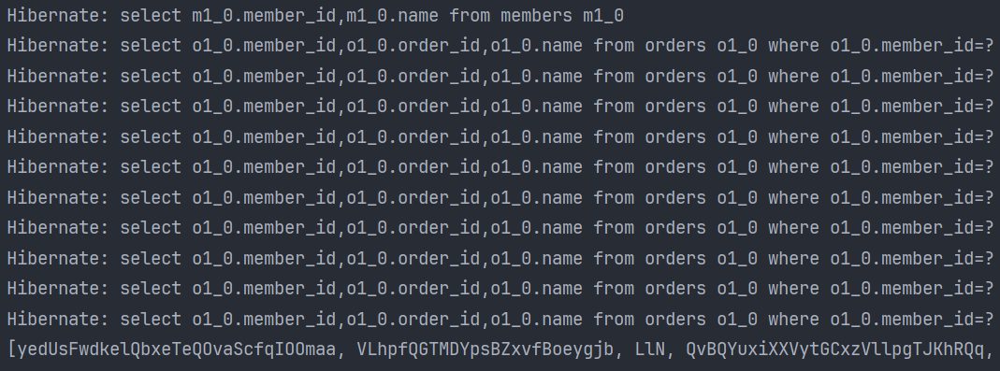

> - 하위 연관 관계를 조회하지 않는 경우는 괜찮지만  
> - LAZY 로딩의 경우도 하위 연관 관계를 조회하는 경우 **N+1** 문제 발생

## N+1 문제 해결 방법
### LAZY 로딩과 Fetch Join 사용
```java
@Data
@Entity
@NoArgsConstructor
@AllArgsConstructor
@Table(name = "members")
public class Member {
    @Id
    @GeneratedValue(strategy = GenerationType.IDENTITY)
    @Column(name = "member_id")
    private Long id;
    private String name;
    @OneToMany(mappedBy = "member", fetch = FetchType.LAZY, cascade = CascadeType.ALL)
    private List<Order> orders = new ArrayList<>();
}
```

```java
@Query(value = "select m from Member m join fetch m.orders")
List<Member> findAllWithOrder();
```

`Fetch Join`을 사용하는 경우 `inner join`으로 연관 데이터를 조회
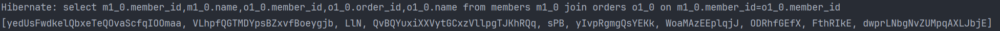

> - `Fetch Join`을 사용하는 경우 N+1 문제는 발생하지 않지만 항상 하위의 데이터를 전부 로딩하게 되므로 메모리를 많이 차지하게 되어 성능상 문제가 발생할 수 있다.
> - 항상 하위 데이터를 전부 로딩하므로 `Pagination`이 어렵다.
> - 그럼에도, 상황에 따라 가장 좋은 해결책

### LAZY 로딩과 EntityGraph 사용
```java
@EntityGraph(attributePaths = {"orders"})
@Query(value = "select m from Member m")
List<Member> findAllEntityGraph();
```

`EntityGraph`를 사용하는 경우 `left join`으로 연관 데이터를 조회
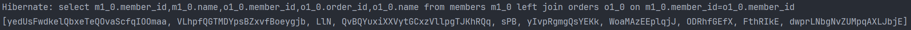

### SubSelect 를 사용
- EAGER 인 경우
  ```java
  @Data
  @Entity
  @NoArgsConstructor
  @AllArgsConstructor
  @Table(name = "bookstores")
  public class BookStore {
      @Id
      @GeneratedValue(strategy = GenerationType.IDENTITY)
      @Column(name = "bookstore_id")
      private Long id;
      private String name;
  
      @Fetch(FetchMode.SUBSELECT)
      @OneToMany(mappedBy = "bookStore", fetch = FetchType.EAGER, cascade = CascadeType.ALL)
      private List<Book> books = new ArrayList<>();
  
      @Override
      public boolean equals(Object o) {
          if (this == o) return true;
          if (o == null || getClass() != o.getClass()) return false;
          BookStore bookStore = (BookStore) o;
          return id != null && id.equals(bookStore.id);
      }
  
      @Override
      public int hashCode() {
          return getClass().hashCode();
      }
  }
  ```
  - 하위 데이터 조회 X
    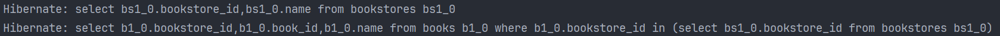
  - 하위 데이터 조회 O
    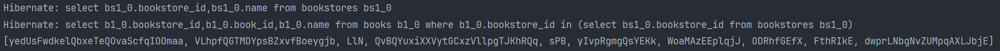
  
  > - `SubSelect` 를 사용하는 경우 2개의 쿼리를 사용하게 되며 **N+1** 문제는 발생하지 않는다.  
  > - 조회는 `IN` 절을 사용하여 이루어진다.  
  > - `Entity` 생성시 `equals`와 `hashcode`를 사용하지 않는 다면 JPA 영속성안에서 객체를 서로 비교하지 못해 순환 참조 오류가 발생할 수 있다.
- LAZY인 경우
  ```java
  @Data
  @Entity
  @NoArgsConstructor
  @AllArgsConstructor
  @Table(name = "companies")
  public class Company {
      @Id
      @GeneratedValue(strategy = GenerationType.IDENTITY)
      @Column(name = "company_id")
      private Long id;
      private String name;
  
      @Fetch(FetchMode.SUBSELECT)
      @OneToMany(mappedBy = "company", fetch = FetchType.LAZY, cascade = CascadeType.ALL)
      private List<Employee> employees = new ArrayList<>();
  
      @Override
      public boolean equals(Object o) {
          if (this == o) return true;
          if (o == null || getClass() != o.getClass()) return false;
          Company bookStore = (Company) o;
          return id != null && id.equals(bookStore.id);
      }
  
      @Override
      public int hashCode() {
          return getClass().hashCode();
      }
  }
  ```
  - 하위 연관 관계 조회 X
    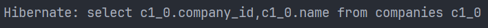
  - 하위 연관 관계 조회 O
    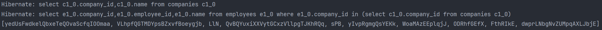
  
  > - `Lazy` 로딩의 경우 하위 연관관계를 조회하는 시점에 추가 쿼리가 발생한다.  
  > - 마찬가지로 `IN` 절을 사용해서 조회하게 된다.

### BatchSize 의 사용
- EAGER 인 경우
  ```java
  @Data
  @Entity
  @NoArgsConstructor
  @AllArgsConstructor
  @Table(name = "schools")
  public class School {
      @Id
      @GeneratedValue(strategy = GenerationType.IDENTITY)
      @Column(name = "school_id")
      private Long id;
      private String name;
  
      @BatchSize(size = 4)
      @OneToMany(mappedBy = "school", fetch = FetchType.EAGER, cascade = CascadeType.ALL)
      private List<Student> students = new ArrayList<>();
  }
  ```
  
  - 하위 연관 관계 조회 X
    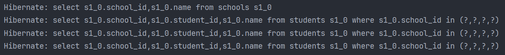
  - 하위 연관 관계 조회 O
    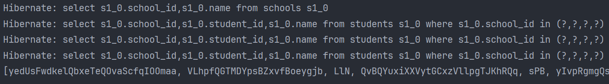
  
  > - 하위 연관 관계 조회 여부와 상관없이 조회가 발생하며 `BatchSize`에 따라 추가 요청이 발생한다.
  
- LAZY 인 경우
  ```java
  @Data
  @Entity
  @NoArgsConstructor
  @AllArgsConstructor
  @Table(name = "pencilcases")
  public class Pencilcase {
      @Id
      @GeneratedValue(strategy = GenerationType.IDENTITY)
      @Column(name = "pencilcase_id")
      private Long id;
      private String name;
  
      @BatchSize(size = 4)
      @OneToMany(mappedBy = "pencilcase", fetch = FetchType.LAZY, cascade = CascadeType.ALL)
      private List<Pencil> pencils = new ArrayList<>();
  }
  ```
  
  - 하위 연관 관계 조회 X
    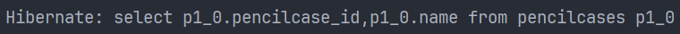
  - 하위 연관 관계 조회 O
    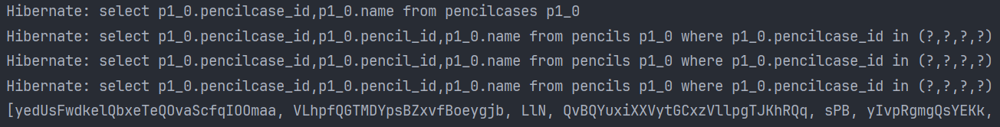
  
  > - 하위 연관 관계를 조회하는 시점에 `BatchSize` 만큼 조회가 발생

> - 이전까지의 경우 항상 전체 데이터를 조회하는 방법
> - 하지만, BatchSize 를 이용할 경우 원하는 개수의 데이만 로딩이 가능하다.
> - 그렇지만 이 경우에도 적절한 BatchSize 를 설정해야 한다. (적절한 BatchSize 는 알 수 없음;;)